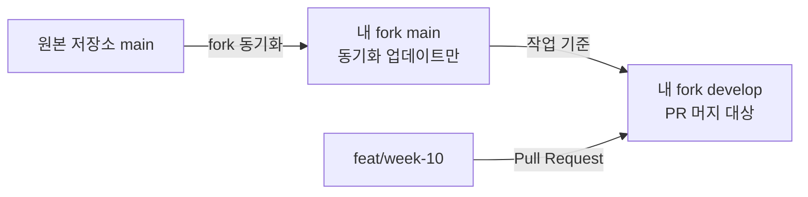

# Week 10 CI 측정과 개선 기록

## 측정 조건

### 현재 workflow와 명령 대조

#### Quality

`.github/workflows/quality.yml`은 검증을 네 step으로 나눠 실행한다. 실제 실행 순서는 다음과 같다.

```text
pnpm test → pnpm lint → pnpm typecheck → pnpm build
```

각 검증을 별도 step으로 두어 test, lint, typecheck와 build 시간을 따로 기록한다. Quality에는
Playwright 브라우저 설치를 두지 않는다.

```yaml
- name: Run unit tests
  run: pnpm test

- name: Run lint
  run: pnpm lint

- name: Run typecheck
  run: pnpm typecheck

- name: Run production build
  run: pnpm build
```

검증 항목을 줄인 것이 아니라 각 구간의 시간을 확인하기 위한 분리다. 이 구조를 Before 기준으로
고정하고 After도 같은 구조에서 측정한다.

#### E2E

`.github/workflows/e2e.yml`은 Chromium과 WebKit을 matrix job으로 나눠 각 브라우저에서 설치,
production build와 Playwright 테스트를 독립적으로 실행한다.

```text
matrix.browser = chromium | webkit
pnpm exec playwright install --with-deps ${{ matrix.browser }}
pnpm build
pnpm exec playwright test --project=${{ matrix.browser }}
```

E2E는 실제 Chromium과 WebKit을 사용하므로 브라우저 설치가 필요하다. Quality와 달리 E2E의
브라우저 설치 step은 사용되지 않는 준비 작업으로 볼 수 없다.

### Week 09 참고 실행

#### 참고 실행의 조건

- 대상: Week 09 PR #181
- 실행 결과: 성공
- 러너: `ubuntu-latest`
- GitHub Actions runner: `2.337.0`
- 운영체제: Ubuntu 24.04.4 LTS
- Runner Image: `ubuntu-24.04`
- Runner Image 버전: `20260831.293.1`
- Hosted Compute Agent 버전: `20260828.587`
- Quality Azure Region: `northcentralus`
- E2E Azure Region: `centralus`
- `GITHUB_TOKEN` 권한: `contents: read`, `metadata: read`
- Secret source: `None`
- Quality pnpm dependency cache: warm, 복원 성공
- Quality Next.js build cache: 없음
- E2E pnpm dependency cache: warm, 복원 성공
- E2E Next.js build cache: 없음
- 분류: Before 반복 측정에 포함하지 않는 참고 실행

Quality와 E2E는 runner, OS, Runner Image와 이미지 버전이 같았다. 서로 다른 VM에서 실행되므로
Worker ID는 달랐고 Azure Region도 달랐다. 따라서 같은 `ubuntu-latest` 조건이어도 물리적 실행
환경과 네트워크 조건이 완전히 같다고 볼 수는 없으며, 한 번의 시간 차이만으로 개선 효과를 확정하지
않는다.

두 실행 모두 같은 pnpm cache key의 약 197MB store를 복원했다. Quality의 `Set up Node.js`는
10초, E2E는 9초였고 `Install dependencies`는 둘 다 2초였다. 두 실행 모두 pnpm cache 기준
warm이지만 변경 전 Week 09 참고 실행이므로 새 기준 workflow의 Before 3회에는 포함하지 않는다.

#### Quality 상세 시간

| 범위                                  |     시간 |
| ------------------------------------- | -------: |
| Quality workflow 전체                 | 1분 23초 |
| quality job                           | 1분 18초 |
| Set up job                            |      1초 |
| Checkout                              |      1초 |
| Set up pnpm                           |      3초 |
| Set up Node.js                        |     10초 |
| Install dependencies                  |      2초 |
| Install Playwright Chromium when used |     24초 |
| Run quality checks                    |     33초 |
| Post Set up Node.js                   |      0초 |
| Post Set up pnpm                      |      1초 |
| Post Checkout                         |      0초 |
| Complete job                          |      0초 |

`Run quality checks` 로그에서 추가로 확인한 값은 다음과 같다.

| 내부 명령 또는 출력 구간 | 확인한 시간 | 측정 범위                            |
| ------------------------ | ----------: | ------------------------------------ |
| `vitest run`             |      9.66초 | Vitest가 출력한 전체 test duration   |
| Next.js compile          |       3.7초 | build 내부 compile 구간              |
| Next.js TypeScript       |       3.8초 | build 내부 TypeScript 구간           |
| 17개 static page 생성    |       211ms | build 내부 page 생성 구간            |
| `pnpm lint`              |   구분 불가 | 시작 로그만 있고 전체 종료 시간 없음 |
| `pnpm typecheck`         |   구분 불가 | 시작 로그만 있고 전체 종료 시간 없음 |
| `pnpm build` 전체        |   구분 불가 | 일부 내부 구간만 출력됨              |

따라서 이 로그만으로 test, lint, typecheck와 build 네 명령의 정확한 개별 wall-clock을 모두 구할 수는
없다. 네 명령을 GitHub Actions의 별도 step으로 나누면 각 step의 시간을 같은 형식으로 확인할 수
있다.

테스트는 29개 파일의 164개 테스트가 모두 통과했다. Zustand persist storage 관련 메시지가
`stderr`에 반복됐지만 테스트 실패로 이어지지는 않았다. build 로그에는 E2E와 마찬가지로
`No build cache found`가 출력됐다.

Quality의 `Set up Node.js` 로그에서도 E2E와 같은 pnpm cache key, 약 197MB cache,
`Cache restored successfully`를 확인했다. 따라서 Quality 역시 pnpm dependency cache 기준
warm이고 Next.js build cache는 없는 실행이다.

#### 확인한 사실

이 실행에서 Chromium 설치에는 24초가 걸렸고, `pnpm check`는 Playwright E2E를 실행하지 않았다.
따라서 Quality의 Chromium 설치는 실제 Quality 검증에 사용되지 않는다. 반면 test, lint,
typecheck와 build는 과제에서 유지해야 하는 검증이다.

#### 개선 가설

Quality에서 Chromium 설치 step만 제거하면 필요한 검증을 유지하면서 quality job과 workflow 전체
시간이 줄어들 것으로 예상한다. 다만 24초는 한 번의 실행에서 관찰한 설치 시간이지 확정된 단축량은
아니다. 실제 감소 폭은 같은 조건의 Before/After cold·warm 반복 측정으로 확인한다.

#### E2E 참고 시간

| 범위                        |     시간 |
| --------------------------- | -------: |
| E2E workflow 전체           | 2분 30초 |
| e2e job                     | 2분 26초 |
| Set up job                  |      1초 |
| Checkout                    |      2초 |
| Set up pnpm                 |      3초 |
| Set up Node.js              |      9초 |
| Install dependencies        |      2초 |
| Install Playwright browsers |     47초 |
| Run E2E tests               | 1분 19초 |
| Post Set up Node.js         |      0초 |
| Post Set up pnpm            |      1초 |
| Post Checkout               |      0초 |
| Complete job                |      0초 |

E2E의 step별 시간은 확인했다. `Run E2E tests` 로그에서 production build 후 Chromium과 WebKit의
30개 테스트를 4 workers로 실행했고, 모두 통과했다. Playwright가 출력한 테스트 시간은
1.2분이었다.

build 로그에서는 다음 시간을 확인했다.

- optimized production build compile: 3.5초
- TypeScript: 3.4초
- 17개 static page 생성: 179ms

다만 이 값만 더해 build 전체 wall-clock을 확정할 수는 없다. `Run E2E tests` 1분 19초는 shell에서
측정한 전체 step 시간이고, Playwright의 1.2분은 소수점 한 자리로 반올림된 테스트 시간이다.

`Set up Node.js` 로그에서는 다음 pnpm dependency cache 증거를 확인했다.

- Node: `.nvmrc`에서 해석한 `24.17.0`, Linux x64
- cache key: `node-cache-Linux-x64-pnpm-4a4700f92bc4c477613076faf7033fe016210cf5d6a9cb6fb03827e2819d41f9`
- cache size: 약 197MB
- `Cache hit for`, `Cache restored successfully`, `Cache restored from key` 출력

따라서 이 E2E 실행은 pnpm dependency cache 기준으로 warm이다. 반면 build 로그에는
`No build cache found`가 출력됐으므로 Next.js build cache는 없었다. 서로 다른 캐시이므로 이
실행을 모든 캐시가 warm 또는 cold였다고 한 단어로 묶지 않는다.

## Before

### 측정 전 준비

- [x] Quality의 test, lint, typecheck와 build를 각각 별도 step으로 나눈다
- [x] Quality와 E2E job에 `timeout-minutes: 10`을 추가한다
- [x] 네 검증이 기존 `pnpm check`와 동일하게 유지되는지 대조한다
- [x] 기준 커밋과 Actions run URL을 기록한다
- [x] cold와 warm을 만드는 방법과 캐시 복원 로그의 확인 위치를 정한다
- [x] workflow 전체, job, 주요 step 시간을 기록할 표를 준비한다

### 기준 workflow 변경 이력

- Quality에서 사용하지 않는 Chromium 설치 step을 제거했다.
- Quality의 `pnpm check`를 test, lint, typecheck와 build 네 step으로 나눴다.
- E2E의 `pnpm test:e2e`를 production build와 Playwright test 두 step으로 나눴다.
- Quality와 E2E job에 `timeout-minutes: 10`을 추가했다.
- `pnpm verify` 결과 29개 파일의 164개 테스트, lint와 typecheck가 통과했다.
- production build와 Playwright는 저장소의 런타임 검증 규칙에 따라 로컬에서 실행하지 않았다.
- warm과 cold 각 3회차의 Quality/E2E Actions run URL과 커밋 SHA,
  workflow/job/주요 step 시간과 캐시 로그를 모두 기록했다.

### 측정 기록

#### Cold

| 회차 | 커밋 / run URL                                                                                                                                                                                                                                                        |                   workflow 전체 |                             job | 주요 step                                                                                                                           | 캐시 증거                                                                                                                                    |
| ---- | --------------------------------------------------------------------------------------------------------------------------------------------------------------------------------------------------------------------------------------------------------------------- | ------------------------------: | ------------------------------: | ----------------------------------------------------------------------------------------------------------------------------------- | -------------------------------------------------------------------------------------------------------------------------------------------- |
| 1    | [Quality run](https://github.com/im-wen3y/loop-pack-fe-l2-vol1/actions/runs/34442468386)<br>[E2E run](https://github.com/im-wen3y/loop-pack-fe-l2-vol1/actions/runs/34442468432)<br>커밋 `b9e92f8ff29996cdb075c2afd36f66263512b1ba`                                   |     Quality 50초<br>E2E 2분 6초 |     Quality 47초<br>E2E 2분 3초 | Quality: install 5초, test 9초, lint 7초, typecheck 3초, build 7초<br>E2E: install 5초, browser 설치 44초, build 8초, E2E 48초      | Quality/E2E: `pnpm cache is not found`<br>E2E 후처리의 동일 키 저장은 Quality와의 동시 생성으로 충돌했으나 job은 성공                        |
| 2    | [Quality job](https://github.com/im-wen3y/loop-pack-fe-l2-vol1/actions/runs/34443757239/job/102763993670)<br>[E2E job](https://github.com/im-wen3y/loop-pack-fe-l2-vol1/actions/runs/34443757278/job/102763993821)<br>커밋 `de540b8d435b3c452f38a096d1396fd76662105e` | Quality 1분 6초<br>E2E 2분 49초 | Quality 1분 3초<br>E2E 2분 46초 | Quality: install 6초, test 12초, lint 9초, typecheck 4초, build 10초<br>E2E: install 6초, browser 설치 1분 7초, build 8초, E2E 57초 | Quality/E2E: `pnpm cache is not found`, Next build cache miss<br>Quality가 동일 pnpm 키 저장, E2E 저장은 동시 생성으로 충돌했으나 job은 성공 |
| 3    | [Quality job](https://github.com/im-wen3y/loop-pack-fe-l2-vol1/actions/runs/34444582676/job/102766498626)<br>[E2E job](https://github.com/im-wen3y/loop-pack-fe-l2-vol1/actions/runs/34444582659/job/102766498665)<br>커밋 `6511cdc91550e1a9045b1879ee8e9174d62f55de` |    Quality 57초<br>E2E 2분 38초 |    Quality 53초<br>E2E 2분 27초 | Quality: install 6초, test 8초, lint 8초, typecheck 2초, build 8초<br>E2E: install 5초, browser 설치 52초, build 8초, E2E 1분 10초  | Quality/E2E: `pnpm cache is not found`, Next build cache miss<br>Quality가 동일 pnpm 키 저장, E2E 저장은 동시 생성으로 충돌했으나 job은 성공 |

- Quality workflow 중앙값: 57초, 범위 50초~1분 6초
- Quality job 중앙값: 53초, 범위 47초~1분 3초
- E2E workflow 중앙값: 2분 38초, 범위 2분 6초~2분 49초
- E2E job 중앙값: 2분 27초, 범위 2분 3초~2분 46초

#### Warm

| 회차 | 커밋 / run URL                                                                                                                                                                                                                                                        |                workflow 전체 |                          job | 주요 step                                                                                                   | 캐시 증거                                                                                                                                |
| ---- | --------------------------------------------------------------------------------------------------------------------------------------------------------------------------------------------------------------------------------------------------------------------- | ---------------------------: | ---------------------------: | ----------------------------------------------------------------------------------------------------------- | ---------------------------------------------------------------------------------------------------------------------------------------- |
| 1    | [Quality job](https://github.com/im-wen3y/loop-pack-fe-l2-vol1/actions/runs/34388626221/job/102591140674)<br>[E2E job](https://github.com/im-wen3y/loop-pack-fe-l2-vol1/actions/runs/34388626456/job/102591141913)<br>커밋 `1c4d8e2ac4169022285e56f944ce492b42bc7625` |  Quality 57초<br>E2E 3분 4초 | Quality 54초<br>E2E 2분 24초 | Quality: test 11초, lint 10초, typecheck 3초, build 11초<br>E2E: browser 설치 51초, build 12초, E2E 57초    | pnpm cache hit/restored<br>key: `node-cache-Linux-x64-pnpm-4a4700f92bc4c477613076faf7033fe016210cf5d6a9cb6fb03827e2819d41f9`<br>약 197MB |
| 2    | [Quality job](https://github.com/im-wen3y/loop-pack-fe-l2-vol1/actions/runs/34389832684/job/102595119971)<br>[E2E run](https://github.com/im-wen3y/loop-pack-fe-l2-vol1/actions/runs/34389832675)<br>커밋 `c4192a458aa3e9dfa187eec53bbca1763211645f`                  | Quality 55초<br>E2E 2분 33초 | Quality 53초<br>E2E 2분 30초 | Quality: test 11초, lint 10초, typecheck 3초, build 11초<br>E2E: browser 설치 57초, build 10초, E2E 1분 5초 | pnpm cache hit/restored<br>key: `node-cache-Linux-x64-pnpm-4a4700f92bc4c477613076faf7033fe016210cf5d6a9cb6fb03827e2819d41f9`<br>약 197MB |
| 3    | [Quality run](https://github.com/im-wen3y/loop-pack-fe-l2-vol1/actions/runs/34390806195)<br>[E2E run](https://github.com/im-wen3y/loop-pack-fe-l2-vol1/actions/runs/34390806199)<br>커밋 `8a6c4a6658176e4487cbe4eb1a4dc0cbd638d7db`                                   | Quality 53초<br>E2E 2분 10초 |  Quality 50초<br>E2E 2분 7초 | Quality: test 9초, lint 8초, typecheck 3초, build 9초<br>E2E: browser 설치 46초, build 8초, E2E 53초        | Quality/E2E: pnpm cache hit/restored, key 동일, 약 197MB                                                                                 |

- 원본 값: Quality/E2E warm 3회 모두 기록 완료
- Quality workflow 중앙값: 55초, 범위 53~57초
- Quality job 중앙값: 53초, 범위 50~54초
- E2E workflow 중앙값: 2분 33초, 범위 2분 10초~3분 4초
- E2E job 중앙값: 2분 24초, 범위 2분 7초~2분 30초
- 러너: Quality `eastus`, E2E `westcentralus`; 둘 다 Ubuntu 24.04.4 / `ubuntu-24.04` / image `20260831.293.1`

### 병목 판단

Before 반복 측정에서 가장 긴 구간은 E2E의 `Run E2E tests`였다. 중앙값은 warm 57초,
cold 57초이며, 다음으로 긴 `Install Playwright browsers`는 warm 51초, cold 52초였다.
pnpm 캐시 유무에 따른 install 시간 차이는 작았으며, Next build cache는 cold 3회 모두 miss였다.
개선 전 측정이므로 실제 단축량은 After 측정 전까지 확정하지 않는다.

## After

개선 적용 후 Before와 같은 검증 항목, 러너, Node 버전과 cold/warm 조건에서 각각 3회 측정한다.
Warm과 cold 모두 3회 측정을 완료했다. cold 2회차의 첫 시도는 캐시가 복원되어 집계에서 제외하고
재측정했다. 각 회차의 캐시 상태는 `Set up Node.js` 로그와 install 시간으로 확인했다.

### Cold

| 회차 | 커밋 / run URL                                                                                                                                                                                                                      |                         workflow 전체 |                                                              job | 주요 step                                                                                                                                                                                                      | 캐시 증거                                                                                              |
| ---- | ----------------------------------------------------------------------------------------------------------------------------------------------------------------------------------------------------------------------------------- | ------------------------------------: | ---------------------------------------------------------------: | -------------------------------------------------------------------------------------------------------------------------------------------------------------------------------------------------------------- | ------------------------------------------------------------------------------------------------------ |
| 1    | [Quality run](https://github.com/im-wen3y/loop-pack-fe-l2-vol1/actions/runs/34460080571)<br>[E2E run](https://github.com/im-wen3y/loop-pack-fe-l2-vol1/actions/runs/34460080641)<br>커밋 `99ce7b9f81885ea0c6e249c3e6e991c41e26794e` |          Quality 58초<br>E2E 1분 57초 |             Quality 53초<br>Chromium 1분 39초<br>WebKit 1분 53초 | Quality: install 7초, test 9초, lint 7초, typecheck 3초, build 8초<br>E2E Chromium: install 4초, browser 설치 45초, build 7초, E2E 23초<br>E2E WebKit: install 6초, browser 설치 30초, build 8초, E2E 56초     | `pnpm cache is not found` · Quality install 7초(warm 2초 대비 미복원)                                  |
| 2    | [Quality run](https://github.com/im-wen3y/loop-pack-fe-l2-vol1/actions/runs/34461266607)<br>[E2E run](https://github.com/im-wen3y/loop-pack-fe-l2-vol1/actions/runs/34461266531)<br>커밋 `e3cd5e23a1f7846bab48643490f98a6fc1bce44e` | Quality 약 1분 9초<br>E2E 약 3분 31초 | Quality 약 1분 5초<br>Chromium 약 1분 16초<br>WebKit 약 1분 38초 | Quality: install 6초, test 11초, lint 10초, typecheck 4초, build 9초<br>E2E Chromium: install 2초, browser 설치 22초, build 9초, E2E 25초<br>E2E WebKit: install 5초, browser 설치 33초, build 9초, E2E 37초   | `pnpm cache is not found` · Quality install 6초. E2E workflow는 Chromium job 대기로 전체 시간이 늘어남 |
| 3    | [Quality run](https://github.com/im-wen3y/loop-pack-fe-l2-vol1/actions/runs/34461971077)<br>[E2E run](https://github.com/im-wen3y/loop-pack-fe-l2-vol1/actions/runs/34461971079)<br>커밋 `33737f611b6e53b7ad15b4b49460450896ca6c23` |       Quality 1분 9초<br>E2E 2분 20초 |          Quality 1분 6초<br>Chromium 1분 18초<br>WebKit 1분 42초 | Quality: install 6초, test 11초, lint 10초, typecheck 3초, build 10초<br>E2E Chromium: install 6초, browser 설치 27초, build 8초, E2E 21초<br>E2E WebKit: install 5초, browser 설치 30초, build 10초, E2E 40초 | `pnpm cache is not found` · Quality install 6초                                                        |

- Quality workflow 중앙값: 1분 9초, 범위 58초~1분 9초
- Quality job 중앙값: 1분 5초, 범위 53초~1분 6초
- E2E workflow 중앙값: 2분 20초, 범위 1분 57초~3분 31초
- E2E job 중앙값(느린 브라우저): 1분 42초, 범위 1분 38초~1분 53초

### Warm

| 회차 | 커밋 / run URL                                                                                                                                                                                                                      |                   workflow 전체 |                                                     job | 주요 step                                                                                                                                                                                                      | 캐시 증거                                       |
| ---- | ----------------------------------------------------------------------------------------------------------------------------------------------------------------------------------------------------------------------------------- | ------------------------------: | ------------------------------------------------------: | -------------------------------------------------------------------------------------------------------------------------------------------------------------------------------------------------------------- | ----------------------------------------------- |
| 1    | [Quality run](https://github.com/im-wen3y/loop-pack-fe-l2-vol1/actions/runs/34456469894)<br>[E2E run](https://github.com/im-wen3y/loop-pack-fe-l2-vol1/actions/runs/34456469924)<br>커밋 `a9129272f963b1af19978e6ba2cf9d0f39375e4c` | Quality 1분 6초<br>E2E 1분 46초 | Quality 1분 3초<br>Chromium 1분 37초<br>WebKit 1분 44초 | Quality: install 2초, test 12초, lint 10초, typecheck 3초, build 10초<br>E2E Chromium: install 2초, browser 설치 38초, build 9초, E2E 24초<br>E2E WebKit: install 2초, browser 설치 35초, build 10초, E2E 39초 | `Cache restored from key` · Quality install 2초 |
| 2    | [Quality run](https://github.com/im-wen3y/loop-pack-fe-l2-vol1/actions/runs/34456907155)<br>[E2E run](https://github.com/im-wen3y/loop-pack-fe-l2-vol1/actions/runs/34456907202)<br>커밋 `594a9e7c494faea86ad8a99f8d5c7a1f68030fbe` |    Quality 55초<br>E2E 1분 33초 |    Quality 52초<br>Chromium 1분 27초<br>WebKit 1분 24초 | Quality: install 2초, test 10초, lint 9초, typecheck 4초, build 10초<br>E2E Chromium: install 3초, browser 설치 38초, build 7초, E2E 21초<br>E2E WebKit: install 2초, browser 설치 34초, build 6초, E2E 27초   | `Cache restored from key` · Quality install 2초 |
| 3    | [Quality run](https://github.com/im-wen3y/loop-pack-fe-l2-vol1/actions/runs/34458232736)<br>[E2E run](https://github.com/im-wen3y/loop-pack-fe-l2-vol1/actions/runs/34458232732)<br>커밋 `dac4d0e8aa87a3778a9bd23d0e60a2d9985241ed` |    Quality 57초<br>E2E 1분 54초 |    Quality 54초<br>Chromium 1분 21초<br>WebKit 1분 48초 | Quality: install 2초, test 11초, lint 9초, typecheck 4초, build 9초<br>E2E Chromium: install 2초, browser 설치 24초, build 10초, E2E 24초<br>E2E WebKit: install 2초, browser 설치 39초, build 10초, E2E 38초  | `Cache restored from key` · Quality install 2초 |

- Quality workflow 중앙값: 57초, 범위 55~1분 6초
- E2E workflow 중앙값: 1분 46초, 범위 1분 33초~1분 54초
- E2E job 중앙값(느린 브라우저): 1분 37초, 범위 1분 37초~1분 44초

### Before와 비교

- Quality workflow 중앙값은 55초에서 1분 9초로 14초 늘었지만, Quality workflow는 후보 A 변경
  대상이 아니므로 후보 A의 영향으로 해석하지 않는다.
- E2E workflow 중앙값은 2분 33초에서 2분 20초로 13초 줄었다. 사전에 정한 30초 단축 기준에는
  미달해 PR 전체 wall-clock 성능 개선은 유의미하다고 확정하지 않는다.
- 느린 브라우저 job 중앙값은 2분 24초에서 1분 42초로 42초 줄었다. 이는 브라우저별 실행을
  분리한 구조적 효과지만, workflow 전체 시간 단축과 동일한 의미로 보지 않는다.
- 최종 결정: 후보 A는 Chromium·WebKit 실패를 독립적으로 확인하고 각각 required check로 보호할
  수 있어 유지한다. 후보 B concurrency도 반복 push의 오래된 실행을 줄이는 운영 안전장치로 유지한다.
- 후보 C pnpm store 캐시는 현재 install 시간이 짧고 추가 효과 근거가 부족해 보류한다.

## 캐시

- warm 실행의 캐시 복원 로그: 기존 After 3회에서 `Cache restored from key` 확인
- 의도적인 캐시 miss 로그: Quality와 WebKit에서 `pnpm cache is not found` 확인
- hit install 시간: Chromium 2초
- miss install 시간: Quality 7초, WebKit 6초
- 캐시 키를 바꾸기 위해 사용한 lockfile 변경: 실행 완료(커밋 `91cabde25d6fc3144146541b354639b9a1c217e6`)
- 실험 Quality run: https://github.com/im-wen3y/loop-pack-fe-l2-vol1/actions/runs/34466947559
- 실험 E2E run: https://github.com/im-wen3y/loop-pack-fe-l2-vol1/actions/runs/34466947550
- 실험 후 lockfile 복구: 완료(커밋 `8fe73a0b182bfa45c387f2982c4a4394da3cc60e`).
  `git diff 91cabde2~1 HEAD -- pnpm-lock.yaml package.json`이 비어 있어 실험 전 상태와 동일하다.

이번 실험은 matrix job이 동일한 새 cache key를 공유했다. 먼저 끝난 job이 캐시를 저장한 뒤
Chromium job이 시작되어 Chromium에서는 `Cache restored successfully`가 나타났다. 따라서 세 job
모두를 cold로 보지 않고, Quality·WebKit miss와 Chromium hit가 섞인 부분 cold 실험으로 분류한다.
matrix 전략 자체에는 cold를 강제하는 옵션이 없다. 브라우저별 key를 따로 만들거나 run ID를 key에
넣으면 miss를 만들 수 있지만, 이는 평소 캐시 공유·복원 동작과 다른 실험 조건이 된다. job을
순차화하고 매번 캐시를 삭제하는 방법도 있지만 병렬화의 전제가 사라지고 삭제 시점 경합이 생긴다.

캐시 hit/miss의 원본 로그와 install 시간을 함께 기록한다. miss는 frozen install이 실패하는 손상이
아니라 유효한 lockfile 변경으로 재현하고, 실험 변경은 측정 후 복구한다.

## 실행 조건

### 브랜치 흐름과 PR 대상

현재 fork의 `feat/week-10`에서 fork의 `develop`으로 PR을 올리고, `develop`을 통합 대상
브랜치로 사용한다. fork의 `main`은 원본 저장소와 동기화할 때만 업데이트한다. 이렇게 하면
작업 PR을 `main`에 직접 올릴 때 생길 수 있는 fork 브랜치 충돌을 피하면서, 실제 과제 변경은
`develop`에서 검증하고 머지할 수 있다.



- PR base: `develop`
- `main`: fork 동기화용 업데이트만 수행
- 기능·문서 변경: `feat/week-10` 등 작업 브랜치에서 `develop`으로 PR

- 저비용 결정적 검증을 모든 PR에서 실행할지: 현재 Quality workflow를 그대로 유지
- E2E 실행 조건: 경로 기반 분류를 사용하며, 로직 변경 시 결제·주문 E2E를 항상 실행
- 스킵할 변경 범위: 문서와 CSS만 변경된 PR
- 스킵이 안전한 이유: 문서·CSS-only는 브라우저 동작 로직을 변경하지 않는다는 경로 규칙
- 조건에 걸려 E2E가 실행된 PR과 로그: PR #12에서 `all=true`, Chromium/WebKit 각 15개 통과.
  2026-09-11 PR #14(order 1개), #15(auth 계열 5개), #16(unknown 15개)에서 범위별 실행 확인
- 조건에 걸리지 않아 E2E가 스킵된 PR과 로그: 2026-09-11 PR #13(문서-only)에서
  `scope result: all=false, run_e2e=false, tests=(skipped)`와 Checkout 이후 7개 step Skipped 확인.
  두 browser job은 Success로 종료
- required check와 조건부 실행의 충돌: `develop` 대상 `merge-required-ci` ruleset 설정 완료,
  PR #12 Merge box에서 네 check가 Required로 표시됨
- flaky 대응 정책과 근거: CI에서만 재시도 2회를 켜고, 실패·flaky 실행의 Playwright trace를
  아티팩트로 올린다. 재시도는 실패를 감추려는 것이 아니라 흔들림과 진짜 실패를 구분하려는
  것이며, 최초 실패 로그와 trace가 남아야 그 구분이 가능하기 때문이다. 아래
  「flaky 대응 정책」 참고

### Quality 조건 분리 보류 근거

2026년 9월 10일 기준 최근 30개 커밋을 확인했다. `docs/**`만 변경한 커밋은 14개,
CSS-only 커밋은 0개, CI 측정을 위한 empty commit은 10개였다. 실제 파일을 변경한 20개
커밋 중 문서-only 커밋은 14개로 약 70%였다.

문서-only 변경이 많아 Quality를 조건부로 나누면 실행 시간을 줄일 여지는 있다. 그러나 별도
Format job을 만들면 포맷 검사보다 job 시작, checkout, Node·pnpm 준비 시간이 더 큰 비중을
차지할 수 있고 workflow와 required check 관리도 복잡해진다. 이번 단계에서는 Quality를 분리하지
않고 현재 검증을 유지한다. 문서·CSS 변경이 계속 누적되어 Quality 비용이 실제 병목으로 확인되면
그때 문서·스타일 포맷 검사와 전체 Quality를 분리한다.

E2E는 `paths-filter`로 변경 경로를 분류하는 방향을 선택했고 `.github/workflows/e2e.yml`에 반영했다.
로직 변경 시 Chromium과 WebKit에서
결제·주문 E2E를 공통 필수 검사로 실행하고, 인증·장바구니·위시리스트·상품 영역의 변경에는 해당
기능 E2E를 추가한다. 공통 로직이나 설정 변경은 전체 E2E를 실행한다. 이 정책의 실제 workflow
구현과 required 배치, 로직·설정 변경이 포함된 PR의 전체 실행 로그는 확인했다. 문서-only PR의
생략 로그도 2026-09-11 PR #13에서 확보했다. flaky 정책은 아래에 정리했다.

### 감지 실패와 step 실패의 분리 검증

2026-09-11에 버리는 브랜치 두 개로 실패 경로를 확인했다. 두 PR은 머지하지 않는다.

| PR  | 깨뜨린 지점                             | 결과                                                                                                    |
| --- | --------------------------------------- | ------------------------------------------------------------------------------------------------------- |
| #17 | `Detect changed paths`의 `filters` YAML | `Detect E2E scope` failure → `E2E fallback:` 로그와 `all=true, run_e2e=true, tests=all`, 15개 전체 실행 |
| #18 | `Checkout`의 존재하지 않는 `ref`        | `Checkout` failure → 이후 6개 step Skipped, 두 browser job이 각각 독립 Failure                          |

감지 실패는 전체 실행으로 복구되고, 실행 중간 실패는 후속 step을 중단시킨다. 두 동작이 서로를
덮어쓰지 않는다는 것을 실행 로그로 확인했다. 상세 로그와 판정 근거는
[E2E 조건부 실행 문서](../week-10/e2e-conditional-execution.html)의 04-C 절에 있다.

### 관찰된 flaky 사례

PR #17의 fallback 실행에서 Chromium만 15개 중 14개 통과로 끝났다.

```text
✘ [chromium] e2e/state-restoration.spec.ts:110
  debounce가 끝난 검색어는 뒤로·앞으로 이동에서 검색 결과와 함께 복원된다 (12.5s)
  Error: expect(locator).toBeVisible() failed
  > 118 | await expect(page.getByText('총 4개', { exact: true })).toBeVisible()
  Timeout: 10000ms · element(s) not found
```

같은 실행의 WebKit은 15개 모두 통과했고, 같은 spec이 PR #16에서는 두 브라우저 모두 통과했다.
같은 코드가 실행마다 다른 결과를 냈으므로 flaky 신호로 분류한다. workflow 수정과는 무관하며
fallback은 의도대로 전체 실행을 트리거했다.

이 실패를 조사하면서 원인을 사후에 확인할 수 없다는 문제가 함께 드러났다. `trace`는
`retain-on-failure`로 만들어지지만 job이 끝나면 사라졌고, `retries`도 설정되어 있지 않았다.
흔들림과 진짜 실패를 구분할 재료가 하나도 남지 않는 상태였다.

### flaky 대응 정책

먼저 재료를 남기고, 실패 메시지가 원인을 말하게 한 뒤, 마지막에 재시도를 켰다. 재료가 없는
상태에서 재시도부터 켜면 실패를 구분하는 것이 아니라 감추는 쪽이 되기 때문이다.

1. **증거 보존** — 테스트가 실행된 job은 `test-results/`를 아티팩트로 올린다(보관 7일).
   조건은 `steps.e2e.conclusion != 'skipped'`다. 전부 통과하면 `retain-on-failure`가 trace를
   지워 디렉터리가 비므로 `if-no-files-found: ignore`로 아티팩트를 만들지 않는다.
2. **실패 메시지** — 상품 목록은 갱신 실패 시 이전 결과를 유지하고 배너만 띄우므로, 개수 단언이
   "로딩 중"과 "갱신 실패"를 구분하지 못했다. `e2e/fixtures/product-list-assertions.ts`의
   `expectProductCount`가 배너 상태를 실패 메시지에 담는다.
3. **재시도** — `retries: process.env.CI ? 2 : 0`. 로컬은 0으로 두어 흔들림을 즉시 보고,
   CI에서만 2회 재시도한다. 재시도로 통과하면 Playwright가 `flaky`로 보고하고 최초 실패
   메시지도 리포트에 남는다.

반복 실패는 재시도로 덮지 않는다. 같은 spec이 계속 flaky로 남으면 trace를 근거로 원인을
고치거나 격리 여부를 판단한다.

#### 정책 자가 검증 — PR #19

`testInfo.retry === 0`일 때만 실패하는 테스트로 flaky를 결정적으로 재현했다. 두 브라우저 모두
같은 결과였다.

| 확인 항목          | 결과                                                                             |
| ------------------ | -------------------------------------------------------------------------------- |
| 재시도 동작        | 첫 시도 실패 → `retry #1` 통과 → `1 flaky` 표기, job은 성공                      |
| 아티팩트 업로드    | `playwright-chromium-attempt1`(2.42MB), `playwright-webkit-attempt1`(2.25MB)     |
| 첫 실패 trace 보존 | 아티팩트에 `trace.zip`(64 files)과 `error-context.md`가 있고 최초 실패 사유 포함 |

첫 시도에서는 업로드 조건을 `steps.e2e.conclusion == 'failure'`로 두어 아티팩트가 0개였다.
재시도로 통과한 flaky는 step이 `success`라 조건에 걸리지 않았고, 정작 필요한 첫 실패 trace가
버려졌다. 조건을 `!= 'skipped'`로 고친 뒤 위 결과를 얻었다. 정상 실패는 잡고 flaky만 놓치는
형태였으므로 실제 flaky가 날 때까지 드러나지 않았을 결함이다.

`retain-on-failure`는 재시도로 통과해도 첫 실패 시도의 trace를 지우지 않는다는 것도 함께
확인했다. `trace: 'on-first-retry'`로 바꿀 필요는 없다.

## 예산

### 번들 예산

- 7주차 실제 전송 크기: 미확인
- 현재 값의 범위: 미측정
- 임계값과 여유폭: 미결정
- 임계값 근거: 미작성
- 예산 초과 PR의 빨간불: 미검증
- PR 화면의 측정값·한도·초과량 리포트: 미검증
- 수정 후 초록불 복구: 미검증

### 환경 변수 게이트

- 필수 환경 변수 목록: 미결정
- 누락 값 실패: 미검증
- 잘못된 URL 실패: 미검증
- 비공개 값의 `NEXT_PUBLIC_` 노출 실패: 미검증
- 실제 secret의 로그 비노출: 미검증

번들 임계값과 required 배치는 작성자가 실제 측정값과 리스크를 보고 직접 판단한다. Lighthouse CI는
선택이며, 도입하더라도 7주차 측정값과 변동성에 맞는 조건이 필요하다.

## AI 리뷰

### 리뷰 기준과 프롬프트

- 10주간 합의한 프로젝트 규칙을 담은 프롬프트: 미작성
- 현재 PR diff 리뷰: 미실행

### 판별 기록

- 잘 잡아낸 리뷰 1개와 채택 근거: 미확인
- 헛소리한 리뷰 1개와 기각 근거: 미확인
- 프롬프트 수정 전후와 변경 이유: 미작성

AI 리뷰의 CI 통합은 선택이며 로컬 도구로 진행해도 된다. AI는 리뷰 후보를 제시하지만, 채택과
기각은 작성자가 실제 diff와 팀 규칙을 대조해 판단한다. CI에 통합한다면 timeout, max turns,
concurrency, 명시적 트리거, 최소 권한과 secret 노출 방지를 추가로 검토한다.

## 규칙 승격

- 반복 지적의 출처: 미선정
- 결정적으로 참/거짓을 판별할 규칙: 미결정
- ESLint, `no-restricted-syntax` 또는 Danger 등 승격 수단: 미결정
- 위반 코드가 실패하는지: 미검증
- 정상 코드가 통과하는지: 미검증
- 오탐을 발견했을 때 규칙을 좁힌 기록: 미검증
- AI·사람에게 남길 것과 기계로 내릴 것에 대한 판단: 미작성

이미 존재하는 규칙을 이번 주에 새로 승격한 것으로 기록하지 않는다. 어떤 반복 지적을 승격할지는
작성자가 직접 결정한다.

## 질문 답변

각 답변은 작성자가 판단과 근거를 직접 정해 2~4문장으로 작성한다.

### 1. E2E를 모든 PR에 required로 걸면 어떤 문제가 생길까?

미작성

### 2. Lighthouse 점수 하락은 항상 merge blocker여야 할까?

미작성

### 3. Preview 환경이 production API를 바라보면 무슨 일이 생길까?

미작성

### 4. AI가 만든 workflow를 그대로 머지하면 어떤 리스크가 있을까?

미작성

### AI와 작성자의 역할

workflow와 `package.json`의 명령 연결, 시간 범위의 구분과 기록 틀은 AI와 함께 정리했다. GitHub
Actions 화면에서 각 step의 실제 시간을 확인한 것은 작성자다. 최종 병목, 적용할 개선 전략과 개선
효과는 반복 측정 결과를 본 뒤 작성자가 판단한다.
