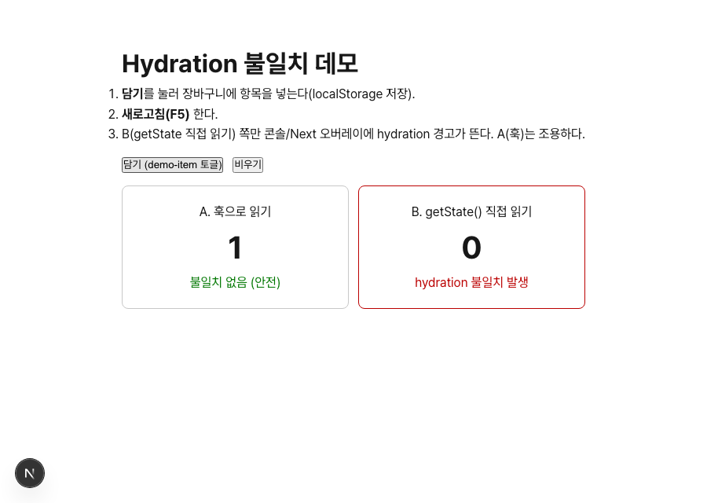
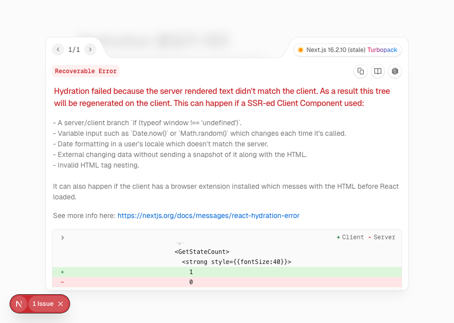

# Hydration 불일치 테스트 리포트

장바구니·위시리스트를 `persist`(localStorage)로 새로고침에도 유지하도록 하면서, "영속 store를 SSR에서 읽으면 hydration 불일치가 나는가, 그리고 이를 막는 가드가 필요한가"를 직접 재현해 확인한 기록이다.

관련 결정 배경은 [`decisions.md`](./decisions.md)의 "10. persist + hydration 가드는 정말 필요했나" 참고.

## 무엇을 테스트했나

**질문**: persist store 값을 서버·클라이언트가 다르게 그리면 hydration 불일치가 나는데, 우리 코드(Header·상품 버튼)도 그 위험이 있는가? 막으려면 별도 가드가 필요한가?

**가설 세 갈래를 두 방식으로 좁혔다.**

| 방식                      | 코드                                 | 예상               |
| ------------------------- | ------------------------------------ | ------------------ |
| A. 훅으로 읽기            | `useCartStore((s) => s.ids.length)`  | 안전(불일치 없음)? |
| B. `getState()` 직접 읽기 | `useCartStore.getState().ids.length` | 불일치 발생?       |

두 방식 모두 "localStorage에 값이 있는 상태로 새로고침"했을 때 서버(초기값 0)와 클라이언트(복원값 1)가 갈리는지를 본다.

## 테스트 방법

1. 비교용 데모 라우트 [`/hydration-demo`](../../src/app/hydration-demo/page.tsx)를 만들었다. A·B 패널이 같은 store를 서로 다른 방식으로 읽어 개수를 표시한다.
2. 개발 서버(`pnpm dev`)를 띄운다.
3. 데모 페이지에서 **담기**를 눌러 장바구니에 항목을 넣는다 → `localStorage`에 `{"state":{"ids":["demo-item"]},"version":1}` 저장.
4. **새로고침(F5)** 한다.
5. 콘솔과 Next.js 개발 오버레이에서 hydration 경고가 어느 패널에서 나는지 관찰한다.

> 재현은 Playwright로도 자동화해 콘솔 `pageerror`와 최종 표시 값을 확인했다. 스크린샷은 동일 시나리오를 캡처한 것이다.

## 결과

### 1) 담기 후 (새로고침 전) — 두 방식 모두 정상 표시

### 2) 새로고침 후 — B(`getState` 직접 읽기)에서만 불일치

Next.js 개발 오버레이가 불일치를 명확히 짚는다. `GetStateCount`에서 **Client는 `1`, Server는 `0`** 으로 갈렸다(훅을 우회해 렌더 중 `getState()`로 복원값을 읽었기 때문).

- **A. 훅으로 읽기** → hydration 경고 없음
- **B. `getState()` 직접 읽기** → `Hydration failed because the server rendered text didn't match the client`

## 왜 훅은 안전한가

zustand 훅은 내부적으로 `useSyncExternalStore`를 쓰며 **`getServerSnapshot`을 "초기 상태(빈 배열)"로 돌려준다.** 그래서 hydration 렌더에서는 서버와 같은 `0`을 그린 뒤, 커밋 후 실제 값으로 전환한다. 훅만 쓰면 서버·클라 첫 렌더가 항상 일치하므로 불일치가 원천적으로 나지 않는다.

불일치는 이 보호를 우회할 때(렌더 도중 `getState()`로 직접 읽기 등)만 발생한다.

## 결론

- 우리 코드의 Header·상품 버튼은 전부 **훅으로 읽으므로 가드 없이 이미 안전**하다.
- 처음 방어용으로 만든 `useStoreHydrated` 가드는 zustand가 이미 보장하는 것을 중복으로 감싼 것이라 **제거**했다.
- persist 자체(`version`/`migrate`/`merge`로 손상값 복구 포함)는 유지하며, 새로고침 후 담긴 목록이 정상 복원됨을 런타임으로 확인했다.
- 교훈: hydration이 걱정될 때 가드부터 두르지 말고, **실제로 불일치가 재현되는지 먼저 확인**하고 필요한 만큼만 대응한다.

> 데모 라우트 `/hydration-demo`는 이 근거를 눈으로 보여주기 위한 개발용이며, 확인이 끝나면 삭제해도 된다.

---

_이 리포트의 테스트 시나리오 구성·데모 페이지·스크린샷 캡처·문서 작성은 AI(Claude)가 사용자와 함께 수행했고, 가드 제거 여부의 최종 결정은 사용자가 했다._
