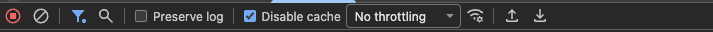
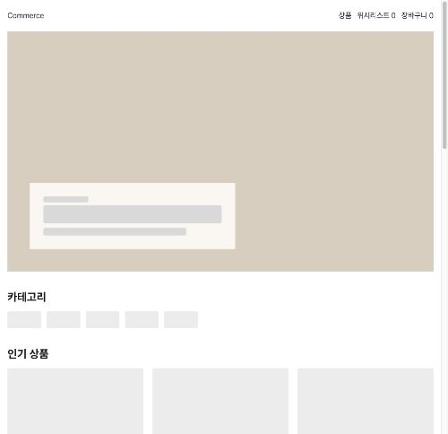
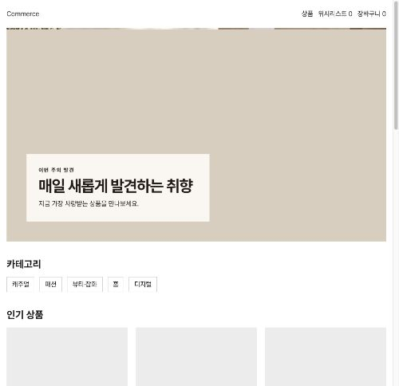

# 7주차 측정 기록

Before / After 측정값과 관찰 결과다. 진행 순서는 [plan.md](plan.md), 체크 항목은 [checklist.md](checklist.md)에 있다.

Step 3(Before)과 Step 7(After)에서 같은 표를 채운다.

## 홈 — 측정 조건

| 항목               | Before                                    | After |
| ------------------ | ----------------------------------------- | ----- |
| SHA                | `3da2db4`                                 |       |
| URL / query string | `http://localhost:3000`                   |       |
| 행동               | 새 탭에서 홈 최초 진입                    |       |
| 실행 방식          | `pnpm build` 후 `pnpm start`              |       |
| 측정 도구          | Lighthouse 13.3.0 (DevTools 패널)         |       |
| Mode / Device      | Navigation / Desktop                      |       |
| throttlingMethod   | `simulate` (RTT 40ms, 10,240Kbps, CPU 1x) |       |
| Network 패널       | **No throttling**                         |       |
| screenEmulation    | `disabled: true` (실제 창 크기)           |       |
| 캐시               | Clear storage + Disable cache             |       |
| 브라우저 / 프로필  | Chrome 150, 시크릿 창                     |       |
| cold load / warm   | cold load                                 |       |
| 측정 일시          | 2026-08-04 21:42~21:44 KST                |       |

Lighthouse의 `simulate`는 스로틀링 없이 수집한 뒤 위 모델로 환산한다. 따라서 **Network 패널 스로틀링은 반드시 꺼야 한다.** 켜두면 수집 단계에 실제 지연이 걸린 위에 시뮬레이션이 한 번 더 얹힌다(아래 폐기 기록 참고).

측정은 `3da2db4` 커밋 직전의 작업 트리에서 수행했고, 그 트리의 코드는 `3da2db4`와 같다. 이후 문서 커밋은 빌드 산출물에 영향을 주지 않는다.

## Lighthouse 5회

Before cold load 5회다. 단위는 ms(CLS 제외).

| 지표 | 1      | 2      | 3      | 4      | 5      | 중앙값 | 최솟값 | 최댓값 |
| ---- | ------ | ------ | ------ | ------ | ------ | ------ | ------ | ------ |
| FCP  | 252.0  | 250.7  | 250.8  | 247.9  | 249.6  | 250.7  | 247.9  | 252.0  |
| LCP  | 8292.0 | 8270.7 | 8270.8 | 8367.9 | 8289.6 | 8289.6 | 8270.7 | 8367.9 |
| CLS  | 0      | 0      | 0      | 0      | 0      | 0      | 0      | 0      |

Performance score 75, Speed Index 약 440ms, TBT 0ms, 서버 응답 8~12ms.

여기서 두 가지가 확정된다.

- **Header는 hero에 막히지 않는다.** FCP 250.7ms, LCP 8,289.6ms로 격차 8초가 전부 hero 몫이다. 다만 `h1`까지 막히지 않는다는 결론은 아래 filmstrip에서 뒤집혔다.
- **CLS가 0이다.** Step 1에서 `HeroSectionSkeleton`에 `aspect-ratio`를 맞춘 것이 동작한다. CLS 항목은 무개입 근거로 쓴다.

### 폐기한 1차 측정 (2026-08-04 21:26~21:31)

Network 패널을 `Fast 4G`로 둔 채 Lighthouse를 돌려 이중 스로틀링이 걸렸다. FCP 577.4ms / LCP 9,297.4ms / CLS 0.0008, score 68이 나왔지만 **Before로 쓰지 않는다.**

판별 근거는 5회 편차다. LCP 편차가 0.6ms(9,296.951~9,297.529)로 계산값에서만 나올 수 있는 값이었고, hero 이미지의 network 시간도 localhost에서 9,462ms로 물리적으로 불가능했다. 스로틀링을 끄자 같은 파일이 61ms로 떨어졌다.

이 측정의 리포트 HTML과 `Fast 4G` 설정 스크린샷은 재측정 때 덮어써서 남아 있지 않다. 위 수치는 폐기 전에 리포트에서 추출한 값이다.

## LCP 구간 분해

Chrome DevTools Performance 패널의 Insights → `LCP breakdown`에서 읽은 값이다. **Lighthouse와 달리 스로틀링 없는 실측이므로 5회 표와 같은 숫자가 아니다.** 측정 조건은 CPU·Network 모두 `No throttling`, Disable cache, 시크릿 창, `Record and reload` 1회다.

| 구간                   | Before                 | After | 비중 | 비고                                                  |
| ---------------------- | ---------------------- | ----- | ---- | ----------------------------------------------------- |
| Time to first byte     | 15ms                   |       | 2%   | head와 `loading.tsx` fallback이 먼저 flush            |
| Resource load delay    | **510ms**              |       | 77%  | document가 532ms에 끝나야 ``가 도착              |
| Resource load duration | 42ms                   |       | 6%   | 7.4MB를 localhost에서 받는 시간                       |
| Element render delay   | 91ms                   |       | 14%  | 디코딩·래스터화                                       |
| **실측 LCP**           | **658.7ms**            |       |      | Performance 패널 LCP 마커                             |
| Hero 전송 크기         | 7,368.7KB (원본 7.5MB) |       |      | `hero-original.jpg` 3840×2160                         |
| LCP element            | Hero 이미지            |       |      | `img.HeroSection-module__lqBdna__image`, Type `image` |

Lighthouse 5회의 LCP 중앙값은 8,289.6ms인데 실측은 658.7ms다. 12배 차이의 원인은 Lighthouse의 `simulate`가 7,545,525 bytes를 10,240Kbps 모델로 환산하기 때문이다(≈5.76초). **localhost에서는 대역폭 병목이 아예 보이지 않는다.**

### Performance filmstrip 표시 순서

같은 녹화(`before-home-record.json`)의 Screenshot 40프레임과 paint 마커를 `navigationStart` 기준으로 정렬한 값이다.

| 시각      | 화면에 새로 나타난 것                                                                               | 대응 마커                                                    |
| --------- | --------------------------------------------------------------------------------------------------- | ------------------------------------------------------------ |
| 110~123ms | Header(로고·상품·위시리스트 0·장바구니 0), `h2` "카테고리"·"인기 상품", Hero·카테고리·카드 스켈레톤 | FCP 125.1ms, LCP candidate 1 = `H2`                          |
| 123~523ms | **변화 없음.** 33프레임이 같은 스켈레톤이다                                                         | 홈 데이터 대기 구간                                          |
| 547ms     | Hero 이미지 상단 일부, `h1` "매일 새롭게 발견하는 취향", 페이지 설명, 카테고리 칩 실제 텍스트       | DOMContentLoaded 526.8ms, LCP candidate 2 = `H1#hero-title`  |
| 563ms     | 인기 상품 카드 이미지                                                                               | firstImagePaint 565.3ms, LCP candidate 3 = `img.ProductCard` |
| 637ms     | Hero 이미지 전체                                                                                    | LCP 658.7ms, candidate 4 = `img.HeroSection`                 |

**Lighthouse 5회에서 내린 결론을 여기서 한 칸 좁힌다.** Header는 110ms에 나오지만 `h1`과 페이지 설명은 547ms까지 없다. 초기 HTML의 최대 텍스트가 `h2`("인기 상품", `frame_y=743`)라는 것이 그 증거다. `h1`이 `HeroSection` 안에 있어서 홈 데이터를 함께 기다린다.

명세 1단계는 "Header, 하나의 `h1`, 페이지 설명까지 함께 막히지 않도록" 요구한다. **Header는 통과하지만 `h1`과 설명은 통과하지 못한다.** Step 4의 렌더링 경계 조정은 근거가 없는 것이 아니라, Header가 아니라 `h1`·설명을 대상으로 해야 한다.

3단계 "JavaScript 실행 전에도 제목이 보여야 한다"와도 같은 지점을 가리킨다. Step 6의 초기 HTML 확인에서 다시 대조한다.

### Network waterfall — 요청 시작 순서와 전송 크기

같은 트레이스의 `ResourceSendRequest` / `ResourceFinish`를 `navigationStart` 기준으로 정렬했다.

| 시작    | 종료    | 크기          | 리소스                                   |
| ------- | ------- | ------------- | ---------------------------------------- |
| 18.7ms  | 526.2ms | 10.2KB        | document `/`                             |
| 19.5ms  | 95.8ms  | **2,009.8KB** | `PretendardVariable.woff2`               |
| 31.6ms  | 62.8ms  | 178.9KB       | CSS·JS 청크 15개(병렬)                   |
| 525.4ms | 568.6ms | **7,368.7KB** | `/images/week-07/hero-original.jpg`      |
| 537.6ms | 557.5ms | 135.9KB       | `/_next/image` 상품 카드 9장(w=640&q=75) |
| 547.6ms | 574.8ms | 7.3KB         | `/products?...&_rsc=` prefetch 11건      |
| 569.9ms | 573.0ms | 25.6KB        | `favicon.ico`                            |

여기서 세 가지가 확인된다.

- **`/api/home` 요청이 waterfall에 없다.** 홈 데이터는 서버에서 RSC로 조회하므로 브라우저 요청으로 나타나지 않는다. slow API 500ms는 document `/`의 18.7~526.2ms 안에 들어 있다. 3단계의 "Browser Network만 보고 Route Handler 호출 횟수를 판정하지 않는다"가 이 상황을 말한다.
- **Hero 요청은 document가 끝나기 직전인 525.4ms에 시작한다.** 스트리밍된 HTML을 preload scanner가 읽은 시점이고, 그 앞 500ms 동안 네트워크는 폰트·청크를 다 받고 놀고 있었다.
- **상품 카드 이미지는 `/_next/image`로 최적화되는데 Hero만 원본 ``다.** 카드 9장 합계가 135.9KB인데 Hero 한 장이 7,368.7KB다. 같은 페이지 안에서 처리 방식이 갈린다.

### 실측이 가리키는 병목 — 요청 시작이 510ms 늦다

DevTools 설명대로 LCP 시간은 대기가 아니라 리소스 로딩에 쓰여야 하는데, 지금은 받는 데 42ms, 기다리는 데 510ms로 정반대다.

원인은 `HomePage`가 `await queryClient.prefetchQuery(homeQueries.detail())`로 홈 API 500ms를 기다린 뒤에야 `HeroSection`이 들어간 HTML을 내보내는 구조다.

`LCP request discovery` 인사이트의 판정은 다음과 같다.

| 항목                                                                | 결과 |
| ------------------------------------------------------------------- | ---- |
| `fetchpriority=high` should be applied to the image preload request | ⛔   |
| Request is discoverable in initial document                         | ✅   |
| LCP resources should not use `loading=lazy`                         | ✅   |

``는 초기 HTML에 있으므로 발견 자체는 문제가 없다. **그 HTML이 늦게 도착하는 것이 문제다.**

아직 저장하지 않은 증거 스크린샷이 세 장 있다. Performance 패널에서 다시 캡처해 아래 경로로 넣고 이 문단 아래에 참조를 건다.

| 파일                                 | 내용                                                               |
| ------------------------------------ | ------------------------------------------------------------------ |
| `./assets/lcp-element.png`           | LCP 마커 Summary — Type `image`, Timestamp 658.7ms, Related node   |
| `./assets/lcp-breakdown.png`         | Insights `LCP breakdown` — 4구간 값                                |
| `./assets/lcp-request-discovery.png` | Insights `LCP request discovery` — 판정 3개와 `fetchpriority` 지적 |

### CLS

Layout Shifts 트랙에 항목이 없고 Insights의 CLS도 `0`이다. `HeroSectionSkeleton`이 실제 Hero와 같은 공간을 잡고 있다. 2단계·4단계의 CLS 항목은 무개입 근거로 쓴다.

### Step 4 개입 후보

두 측정이 서로 다른 구간을 가리킨다. 어느 쪽을 먼저 할지는 아래 "관찰 → 가설 → 반증 → 최소 변경" 표에서 정한다.

**후보 1. Hero 이미지 파일 크기 축소**

- 근거: Lighthouse Before 8,289.6ms에서 전송 환산분(≈5.76초)이 최장 구간이다. Insights도 `Improve image delivery — Est savings 7.5MB`를 지적한다.
- 반증: 크기를 줄였는데 Lighthouse LCP가 비례해 줄지 않으면 전송이 지배 항목이라는 가설이 틀린 것이다.
- 제약: 시각적 크기·비율·피사체·문구를 유지한다. 작게 보이게 하거나 품질을 낮춰 수치만 줄이지 않는다.

**후보 2. `app/layout.tsx` head에 preload + `fetchpriority="high"`**

- 근거: 실측 510ms delay가 전체의 77%다. `HeroSection`의 `src`는 `/images/week-07/hero-original.jpg`로 하드코딩된 정적 URL이라 API 응답과 무관하고, TTFB 15ms에 head가 이미 flush되므로 힌트를 API 대기 전에 내보낼 수 있다.
- 반증: preload를 넣어도 이미지 요청이 여전히 532ms에 시작하면 가설이 틀린 것이다.
- 발제가 경고한 반례(데이터가 와야 URL을 아는 경우)에는 해당하지 않는다.

**후보 3. `h1`·페이지 설명을 홈 데이터 밖으로 빼기**

- 근거: filmstrip에서 `h1`과 설명이 547ms까지 없다. LCP 숫자가 아니라 명세 1단계·3단계 요구사항에 걸린다.
- 반증: 경계를 바꿨는데도 초기 HTML(View Source)에 `h1`이 없으면 가설이 틀린 것이다.

한 번에 하나만 바꾸고 각각 같은 조건에서 재측정한다.
