# 7주차 측정 기록

Before / After 측정값과 관찰 결과다. 진행 순서는 [plan.md](plan.md), 체크 항목은 [checklist.md](checklist.md)에 있다.

Step 3(Before)과 Step 7(After)에서 같은 표를 채운다.

## 홈 — 측정 조건

| 항목               | Before                                    | After |
| ------------------ | ----------------------------------------- | ----- |
| SHA                | `3da2db4`                                 |       |
| URL / query string | `http://localhost:3000`                   |       |
| 행동               | 새 탭에서 홈 최초 진입                    |       |
| 실행 방식          | `pnpm build` 후 `pnpm start`              |       |
| 측정 도구          | Lighthouse 13.3.0 (DevTools 패널)         |       |
| Mode / Device      | Navigation / Desktop                      |       |
| throttlingMethod   | `simulate` (RTT 40ms, 10,240Kbps, CPU 1x) |       |
| Network 패널       | **No throttling**                         |       |
| screenEmulation    | `disabled: true` (실제 창 크기)           |       |
| 캐시               | Clear storage + Disable cache             |       |
| 브라우저 / 프로필  | Chrome 150, 시크릿 창                     |       |
| cold load / warm   | cold load                                 |       |
| 측정 일시          | 2026-08-04 21:42~21:44 KST                |       |

Lighthouse의 `simulate`는 스로틀링 없이 수집한 뒤 위 모델로 환산한다. 따라서 **Network 패널 스로틀링은 반드시 꺼야 한다.** 켜두면 수집 단계에 실제 지연이 걸린 위에 시뮬레이션이 한 번 더 얹힌다(아래 폐기 기록 참고).


측정은 `3da2db4` 커밋 직전의 작업 트리에서 수행했고, 그 트리의 코드는 `3da2db4`와 같다. 이후 문서 커밋은 빌드 산출물에 영향을 주지 않는다.

## Lighthouse 5회

Before cold load 5회다. 단위는 ms(CLS 제외).

| 지표 | 1      | 2      | 3      | 4      | 5      | 중앙값 | 최솟값 | 최댓값 |
| ---- | ------ | ------ | ------ | ------ | ------ | ------ | ------ | ------ |
| FCP  | 252.0  | 250.7  | 250.8  | 247.9  | 249.6  | 250.7  | 247.9  | 252.0  |
| LCP  | 8292.0 | 8270.7 | 8270.8 | 8367.9 | 8289.6 | 8289.6 | 8270.7 | 8367.9 |
| CLS  | 0      | 0      | 0      | 0      | 0      | 0      | 0      | 0      |

Performance score 75, Speed Index 약 440ms, TBT 0ms, 서버 응답 8~12ms.

여기서 두 가지가 확정된다.

- **Header는 hero에 막히지 않는다.** FCP 250.7ms, LCP 8,289.6ms로 격차 8초가 전부 hero 몫이다. 다만 `h1`까지 막히지 않는다는 결론은 아래 filmstrip에서 뒤집혔다.
- **CLS가 0이다.** Step 1에서 `HeroSectionSkeleton`에 `aspect-ratio`를 맞춘 것이 동작한다. CLS 항목은 무개입 근거로 쓴다.

### 폐기한 1차 측정 (2026-08-04 21:26~21:31)

Network 패널을 `Fast 4G`로 둔 채 Lighthouse를 돌려 이중 스로틀링이 걸렸다. FCP 577.4ms / LCP 9,297.4ms / CLS 0.0008, score 68이 나왔지만 **Before로 쓰지 않는다.**

판별 근거는 5회 편차다. LCP 편차가 0.6ms(9,296.951~9,297.529)로 계산값에서만 나올 수 있는 값이었고, hero 이미지의 network 시간도 localhost에서 9,462ms로 물리적으로 불가능했다. 스로틀링을 끄자 같은 파일이 61ms로 떨어졌다.

이 측정의 리포트 HTML과 `Fast 4G` 설정 스크린샷은 재측정 때 덮어써서 남아 있지 않다. 위 수치는 폐기 전에 리포트에서 추출한 값이다.

## LCP 구간 분해

Chrome DevTools Performance 패널의 Insights → `LCP breakdown`에서 읽은 값이다. **Lighthouse와 달리 스로틀링 없는 실측이므로 5회 표와 같은 숫자가 아니다.** 측정 조건은 CPU·Network 모두 `No throttling`, Disable cache, 시크릿 창, `Record and reload` 1회이고, 2026-08-05 13:25 KST에 녹화했다. 코드는 `3da2db4`와 동일하다(`git diff 3da2db4 HEAD -- . ':!docs'`가 비어 있다).

아래 표, filmstrip, waterfall은 **모두 같은 녹화 하나**(`results/before-home-record.json`)에서 뽑았다.

| 구간                   | Before                 | After | 비중 | 비고                                                  |
| ---------------------- | ---------------------- | ----- | ---- | ----------------------------------------------------- |
| Time to first byte     | 19ms                   |       | 3%   | head와 `loading.tsx` fallback이 먼저 flush            |
| Resource load delay    | **514ms**              |       | 78%  | document가 533.6ms에 끝나야 ``가 도착            |
| Resource load duration | 47ms                   |       | 7%   | 7.4MB를 localhost에서 받는 시간                       |
| Element render delay   | 83ms                   |       | 13%  | 디코딩·래스터화                                       |
| **실측 LCP**           | **662.1ms**            |       |      | Performance 패널 LCP 마커                             |
| Hero 전송 크기         | 7,368.7KB (원본 7.5MB) |       |      | `hero-original.jpg` 3840×2160                         |
| LCP element            | Hero 이미지            |       |      | `img.HeroSection-module__lqBdna__image`, Type `image` |


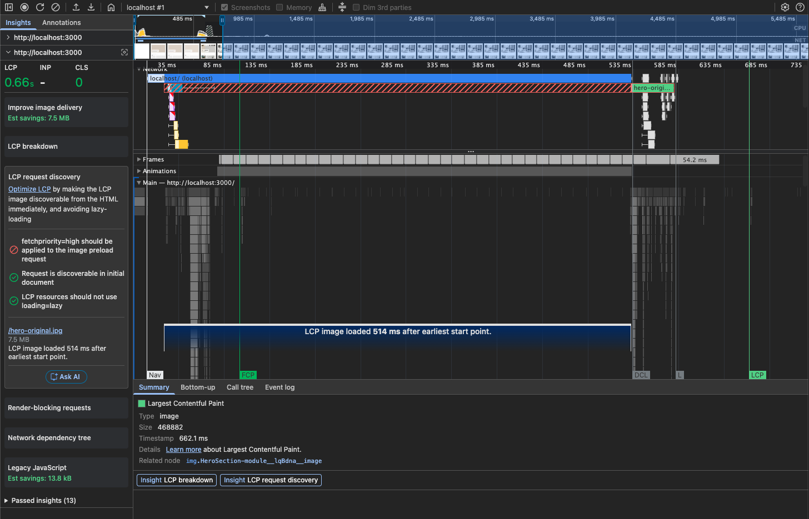

Lighthouse 5회의 LCP 중앙값은 8,289.6ms인데 실측은 662.1ms다. 12배 차이의 원인은 Lighthouse의 `simulate`가 7,545,525 bytes를 10,240Kbps 모델로 환산하기 때문이다(≈5.76초). **localhost에서는 대역폭 병목이 아예 보이지 않는다.**

### Performance filmstrip 표시 순서

같은 녹화(`before-home-record.json`)의 Screenshot 43프레임과 paint 마커를 `navigationStart` 기준으로 정렬한 값이다.

| 시각         | 화면에 새로 나타난 것                                                                               | 대응 마커                                                    |
| ------------ | --------------------------------------------------------------------------------------------------- | ------------------------------------------------------------ |
| 85.5ms       | Header(로고·상품·위시리스트 0·장바구니 0), `h2` "카테고리"·"인기 상품", Hero·카테고리·카드 스켈레톤 | FCP 101.9ms, LCP candidate 1 = `H2`(size 2581)               |
| 85.5~552.8ms | **화면 변화 없음.** 34프레임이 같은 스켈레톤이다                                                    | 홈 데이터 대기 구간                                          |
| 566.0ms      | Hero 이미지 상단 일부, `h1` "매일 새롭게 발견하는 취향", 페이지 설명, 카테고리 칩 실제 텍스트       | DOMContentLoaded 534.1ms, LCP candidate 2 = `H1#hero-title`  |
| 593.3ms      | 인기 상품 카드 이미지                                                                               | firstImagePaint 582.1ms, LCP candidate 3 = `img.ProductCard` |
| 643.7ms      | Hero 이미지 전체                                                                                    | LCP 662.1ms, candidate 4 = `img.HeroSection`                 |

프레임 이미지의 md5는 매 장 다르지만(스켈레톤 shimmer 애니메이션과 JPEG 인코딩 차이), 85.5ms와 552.8ms 프레임을 직접 열어 비교하면 화면 내용은 같다. "변화 없음"은 해시가 아니라 육안 대조로 판정했다.


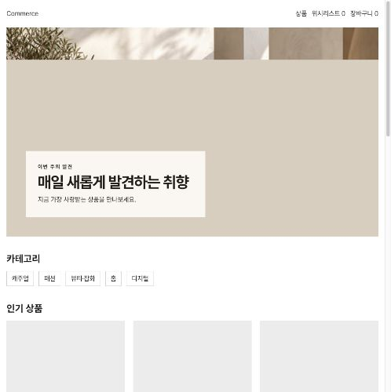
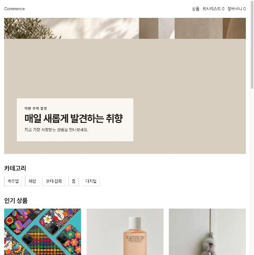
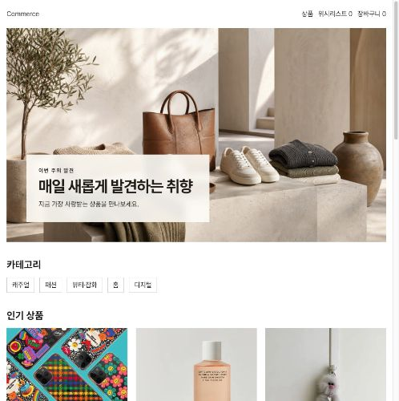

**Lighthouse 5회에서 내린 결론을 여기서 한 칸 좁힌다.** Header는 85.5ms에 나오지만 `h1`과 페이지 설명은 566.0ms까지 없다. 초기 HTML의 최대 텍스트가 `h2`("인기 상품", LCP candidate 1)라는 것이 그 증거다. `h1`이 `HeroSection` 안에 있어서 홈 데이터를 함께 기다린다.

명세 1단계는 "Header, 하나의 `h1`, 페이지 설명까지 함께 막히지 않도록" 요구한다. **Header는 통과하지만 `h1`과 설명은 통과하지 못한다.** Step 4의 렌더링 경계 조정은 근거가 없는 것이 아니라, Header가 아니라 `h1`·설명을 대상으로 해야 한다.

3단계 "JavaScript 실행 전에도 제목이 보여야 한다"와도 같은 지점을 가리킨다. Step 6의 초기 HTML 확인에서 다시 대조한다.

### Network waterfall — 요청 시작 순서와 전송 크기

같은 트레이스의 `ResourceSendRequest` / `ResourceFinish`를 `navigationStart` 기준으로 정렬했다.

| 시작    | 종료    | 크기          | 리소스                                   |
| ------- | ------- | ------------- | ---------------------------------------- |
| 21.9ms  | 533.6ms | 10.2KB        | document `/`                             |
| 22.3ms  | 74.9ms  | **2,009.8KB** | `PretendardVariable.woff2`               |
| 23.7ms  | 60.1ms  | 178.8KB       | CSS·JS 청크 14개(병렬)                   |
| 532.8ms | 580.4ms | **7,368.7KB** | `/images/week-07/hero-original.jpg`      |
| 544.4ms | 560.2ms | 136.0KB       | `/_next/image` 상품 카드 9장(w=640&q=75) |
| 551.2ms | 577.4ms | 8.7KB         | `/products?...&_rsc=` prefetch 11건      |
| 576.6ms | 581.1ms | 19.9KB        | JS 청크 2개(추가 로드)                   |
| 582.1ms | 584.4ms | 25.6KB        | `favicon.ico`                            |

총 40개 요청, 전송 합계 9,757.6KB다.

여기서 세 가지가 확인된다.

- **`/api/home` 요청이 waterfall에 없다.** 홈 데이터는 서버에서 RSC로 조회하므로 브라우저 요청으로 나타나지 않는다. slow API 500ms는 document `/`의 21.9~533.6ms 안에 들어 있다. 3단계의 "Browser Network만 보고 Route Handler 호출 횟수를 판정하지 않는다"가 이 상황을 말한다.
- **Hero 요청은 document가 끝나기 직전인 532.8ms에 시작한다.** 스트리밍된 HTML을 preload scanner가 읽은 시점이고, 그 앞 500ms 동안 네트워크는 폰트·청크를 다 받고 놀고 있었다.
- **상품 카드 이미지는 `/_next/image`로 최적화되는데 Hero만 원본 ``다.** 카드 9장 합계가 136.0KB(webp)인데 Hero 한 장이 7,368.7KB(jpeg)다. 같은 페이지 안에서 처리 방식이 갈린다.

### 실측이 가리키는 병목 — 요청 시작이 514ms 늦다

DevTools 설명대로 LCP 시간은 대기가 아니라 리소스 로딩에 쓰여야 하는데, 지금은 받는 데 47ms, 기다리는 데 514ms로 정반대다.

원인은 `HomePage`가 `await queryClient.prefetchQuery(homeQueries.detail())`로 홈 API 500ms를 기다린 뒤에야 `HeroSection`이 들어간 HTML을 내보내는 구조다.

`LCP request discovery` 인사이트의 판정은 다음과 같다.

| 항목                                                                | 결과 |
| ------------------------------------------------------------------- | ---- |
| `fetchpriority=high` should be applied to the image preload request | ⛔   |
| Request is discoverable in initial document                         | ✅   |
| LCP resources should not use `loading=lazy`                         | ✅   |

``는 초기 HTML에 있으므로 발견 자체는 문제가 없다. **그 HTML이 늦게 도착하는 것이 문제다.** 같은 패널이 `LCP image loaded 514 ms after earliest start point.`라고 표시하는데, 이 514ms가 위 breakdown의 `Resource load delay`와 같은 값이다.

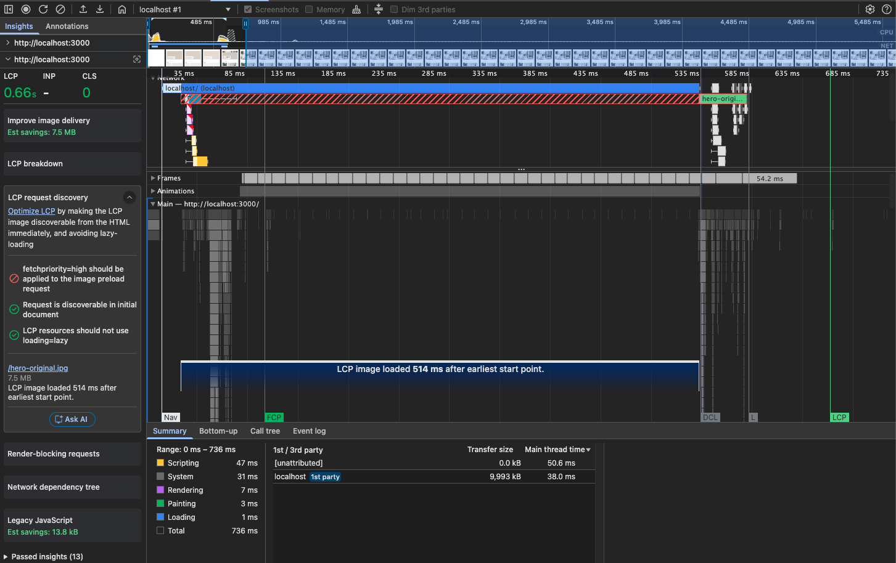

같은 녹화의 Insights에 `Legacy JavaScript`(Est savings 13.8kB), `Render-blocking requests`, `Network dependency tree`도 함께 잡혔다. JS 청크 합계가 178.8KB로 Hero 7.4MB에 비해 두 자릿수 작으므로 이번 병목과 무관하다고 보고 다루지 않는다. 판단이 틀렸다면 Hero를 줄인 뒤에도 LCP가 안 내려가는 것으로 드러날 것이다.

### CLS

Layout Shifts 트랙에 항목이 없고 Insights의 CLS도 `0`이다. `HeroSectionSkeleton`이 실제 Hero와 같은 공간을 잡고 있다. 2단계·4단계의 CLS 항목은 무개입 근거로 쓴다.

### Step 4 개입 후보

두 측정이 서로 다른 구간을 가리킨다. 어느 쪽을 먼저 할지는 아래 "관찰 → 가설 → 반증 → 최소 변경" 표에서 정한다.

**후보 1. Hero 이미지 파일 크기 축소**

- 근거: Lighthouse Before 8,289.6ms에서 전송 환산분(≈5.76초)이 최장 구간이다. Insights도 `Improve image delivery — Est savings 7.5MB`를 지적한다.
- 반증: 크기를 줄였는데 Lighthouse LCP가 비례해 줄지 않으면 전송이 지배 항목이라는 가설이 틀린 것이다.
- 제약: 시각적 크기·비율·피사체·문구를 유지한다. 작게 보이게 하거나 품질을 낮춰 수치만 줄이지 않는다.

**후보 2. `app/layout.tsx` head에 preload + `fetchpriority="high"`**

- 근거: 실측 510ms delay가 전체의 77%다. `HeroSection`의 `src`는 `/images/week-07/hero-original.jpg`로 하드코딩된 정적 URL이라 API 응답과 무관하고, TTFB 15ms에 head가 이미 flush되므로 힌트를 API 대기 전에 내보낼 수 있다.
- 반증: preload를 넣어도 이미지 요청이 여전히 532ms에 시작하면 가설이 틀린 것이다.
- 발제가 경고한 반례(데이터가 와야 URL을 아는 경우)에는 해당하지 않는다.

**후보 3. `h1`·페이지 설명을 홈 데이터 밖으로 빼기**

- 근거: filmstrip에서 `h1`과 설명이 547ms까지 없다. LCP 숫자가 아니라 명세 1단계·3단계 요구사항에 걸린다.
- 반증: 경계를 바꿨는데도 초기 HTML(View Source)에 `h1`이 없으면 가설이 틀린 것이다.

한 번에 하나만 바꾸고 각각 같은 조건에서 재측정한다.

## 상품 목록 — Before 측정 조건

홈과 달리 Lighthouse 5회가 아니라 **Performance 녹화**가 증거다. 명세 0단계는 `/api/products?scenario=slow`에서 (a) 데이터 없는 최초 진입과 (b) 기존 목록이 있는 갱신을 각각 녹화하라고 요구한다.

| 항목              | 값                                          |
| ----------------- | ------------------------------------------- |
| SHA               | `342e857` + slow API 재현용 임시 패치       |
| 실행 방식         | `pnpm build` 후 `pnpm start`                |
| 측정 도구         | Performance 패널 `Record` (Lighthouse 아님) |
| Network 패널      | No throttling, Disable cache                |
| 브라우저 / 프로필 | Chrome 150, 시크릿 창                       |
| 측정 일시         | 2026-08-05 00:02 KST                        |

### slow API 재현 — 임시 패치

이 레포는 `scenario`를 화면에서 API로 전달하지 않는다. `src/_pages/home/api/model.ts`에 "scenario는 mock 검증 전용이라 클라이언트에서 보내지 않는다"고 명시한 기존 설계 결정이다. 그래서 명세가 요구한 slow API(1.5초)를 화면 조작만으로는 재현할 수 없다.

측정 동안만 요청에 `scenario=slow`를 붙인다. **커밋하지 않고 녹화가 끝나면 되돌린다.**

```ts
// src/entities/product/api/api.ts
- response = await fetch(`/api/products${query}`)
+ response = await fetch(`/api/products${query}&scenario=slow`)
```

mock의 기본 지연을 1.5초로 올리는 방법도 대기 시간은 같지만, 요청 URL에 `scenario=slow`가 찍히지 않아 "slow 조건에서 측정했다"를 Network 증거로 입증할 수 없다. 명세 체크리스트가 API의 **URL**을 확인하라고 요구하므로 URL에 남는 쪽을 골랐다.

`src/entities/product/api/api.test.ts:25`가 요청 URL을 단언하므로 이 패치가 있는 동안 `pnpm test`는 실패한다. **이 실패가 되돌리기를 잊지 않게 하는 신호다.** 되돌린 뒤 통과를 확인한다.

### 녹화 시나리오

각 시나리오를 따로 녹화하고 `docs/week-07/`에 트레이스를 내보낸다(파일명은 아래 표 기준).

| #   | 시나리오              | 조작                                                             | 트레이스 파일                                                           |
| --- | --------------------- | ---------------------------------------------------------------- | ----------------------------------------------------------------------- |
| 1   | 데이터 없는 최초 진입 | `Record and reload`로 `/products` 진입                           | `before-products-initial.json`                                          |
| 2   | 기존 목록이 있는 갱신 | 목록이 보이는 상태에서 카테고리 1회 변경                         | `before-products-refetch.json`                                          |
| 3   | 성공 + 0건            | 결과가 없는 검색어 입력                                          | `before-products-empty.json`                                            |
| 4   | 최초 실패 / 갱신 실패 | 에러 응답 상태에서 최초 진입과 갱신을 각각                       | `before-products-init-error.json`, `before-products-refetch-error.json` |
| 5   | 취소 + 빠른 연속 변경 | 카테고리·정렬·페이지를 1초 안에 4회 연속 변경 후 URL과 화면 대조 | `before-products-race.json`                                             |

트레이스를 저장해두면 filmstrip 프레임과 요청 시작 시점을 홈과 같은 방식으로 표에 옮길 수 있다.

### 화면 조작 절차

`/products`의 조작 지점은 셋이다. 검색 `input`(300ms debounce), 카테고리 `select`(전체·캐주얼·패션·뷰티·잡화·홈·디지털), 정렬 `select`(최신순·인기순·낮은 가격순·높은 가격순). 하단에 페이지네이션이 있다.

기록할 화면은 이렇게 구분된다.

| 화면         | 눈으로 확인할 것                                       |
| ------------ | ------------------------------------------------------ |
| 최초 pending | 카드 자리를 잡은 skeleton 12개                         |
| 갱신 중      | 기존 목록이 남은 채 흐려짐(`opacity 0.6`, `aria-busy`) |
| 0건          | "검색 결과가 없습니다."                                |
| 실패         | "상품 목록을 불러오지 못했어요." + `다시 시도` 버튼    |

**1. 데이터 없는 최초 진입** — Performance 패널에서 `Record and reload`(⌘⇧E)로 `/products` 진입. skeleton → 목록 전환까지 녹화.

**2. 기존 목록이 있는 갱신** — 목록이 다 보이는 상태에서 `Record`(⌘E) 시작 → 카테고리를 "전체"에서 "디지털"로 1회 변경 → 새 목록이 뜨면 정지. 이 1.5초 동안 **기존 목록이 지워지지 않고 흐려지기만 하는지**가 관찰 대상이다.

**3. 성공 + 0건** — `Record` 시작 → 검색창에 `zzzz`처럼 결과가 없을 문자열 입력 → "검색 결과가 없습니다."가 뜨면 정지. debounce 300ms가 있으니 입력 후 잠깐 기다린다.

**4. 최초 실패 / 갱신 실패** — Network 패널 우클릭 → `Block request URL` → 패턴에 `*/api/products*` 추가.

- 최초 실패: 차단을 켠 채 `Record and reload`
- 갱신 실패: 차단을 끈 상태로 목록을 띄우고 → 차단을 켠 뒤 → `Record` 시작 → 카테고리 1회 변경

두 화면이 달라야 한다. 최초 실패는 목록 자리에 에러가 오고, 갱신 실패는 **기존 목록이 남은 채** 에러가 붙어야 한다. 녹화가 끝나면 차단 패턴을 지운다.

**5. 취소 + 빠른 연속 변경** — `Record` 시작 → 1.5초 안에 카테고리를 4번 연속으로 바꾼다(캐주얼 → 패션 → 홈 → 디지털) → 마지막 응답이 올 때까지 두고 정지.

> 실제로는 드롭다운을 순서대로 훑느라 5번(캐주얼→잡화→패션→홈→디지털) 바뀌었고 처음~마지막 요청 간격도 1.5초가 아니라 약 4.8초였다. "이전 요청이 끝나기 전에 다음 요청이 나간다"는 핵심 조건은 유지됐다고 판단해 재녹화하지 않았다 — 근거는 [5번 측정 결과](#5-빠른-연속-변경--측정-결과-이번-측정의-핵심) 참고.

정지 후 **주소창의 `category=digital`과 화면의 목록이 일치하는지** 확인한다. 먼저 보낸 요청이 늦게 도착해 화면을 덮으면 그게 관찰 결과다. Network에서 앞선 3건이 `(canceled)`인지 완료인지도 함께 본다.

3·4번은 `scenario=slow` 패치와 무관하게 재현되지만, 패치가 켜져 있으면 1.5초 지연이 함께 걸린다.

**녹화가 모두 끝나면 위 임시 패치를 되돌리고 `pnpm test` 통과를 확인한다.**

### 1. 데이터 없는 최초 진입 — 측정 결과

| 항목                | 값                                                                     |
| ------------------- | ---------------------------------------------------------------------- |
| API 요청            | `/api/products?q=&category=all&…&page=1&pageSize=12&scenario=slow`     |
| API Duration        | **1.51s** (Request sent and waiting 1.50s, Content downloading 0.29ms) |
| FCP                 | **108.1ms** (약 130ms filmstrip에서 skeleton 12개 확인)                |
| LCP                 | **1,628.6ms** — `img.ProductCard-module__KaYlzG__image`, Type `image`  |
| LCP 이미지          | `/_next/image` 16.5KB, earliest start 기준 1,580ms 뒤 로드             |
| CLS                 | **0**                                                                  |
| Main thread 총 작업 | 45.1ms (전체 1,695ms 중)                                               |
| 전송 합계           | 2,445KB                                                                |

**요청 URL에 `scenario=slow`가 찍혔고 서버 대기가 1.50s다.** 요청은 navigationStart 후 66.2ms에 시작해 1,572.3ms에 끝났고, 응답 헤더 대기는 1,505.1ms, 다운로드는 약 0.3ms였다. 임시 패치가 의도대로 동작했고, 이 바는 document가 아니라 XHR이다. `/products` document 자체는 앞쪽에서 빠르게 끝난다.

LCP 후보는 `h1`(108.1ms) → 상품 영역 `h2`(1,615.3ms) → 상품 카드 이미지(1,628.6ms) 순으로 바뀌었다. 최종 LCP 이미지의 발견 시점은 1,588.8ms, 로드 종료는 1,596.1ms다. 즉 이미지 전송 자체보다 API 응답 뒤에야 카드 DOM과 이미지 요청이 생기는 구조가 LCP 시점을 결정한다.

관찰 결과는 세 가지다.

- **skeleton은 이미 요구를 만족한다.** FCP는 108.1ms이고 약 130ms filmstrip에서 카드 12개 자리가 확인된다. 1.5초 뒤 실제 목록으로 바뀔 때도 **CLS가 0**이다. "실제 목록 크기를 예상할 수 있는 pending UI"가 이미 있다.
- **기다림은 전부 서버 지연이다.** 1,695ms 중 메인스레드 작업이 45.1ms고 중간 구간이 통째로 비어 있다. 클라이언트에서 줄일 여지가 없는 대기이며, 명세는 이 1.5초를 줄이지 말라고 명시한다.
- **`LCP request discovery` 3개 항목이 모두 실패한다.** `fetchpriority=high` 미적용, 초기 document에서 발견 불가, `loading=lazy` 사용. 홈은 `fetchpriority` 하나만 실패했는데 여기는 셋 다다.

마지막 항목은 **개입 대상이 아니다.** 상품 카드 이미지는 1.5초짜리 클라이언트 쿼리가 끝난 뒤에 렌더되므로 초기 HTML에 존재할 수 없고, 이는 데이터 조회 전략의 결과지 이미지 속성의 문제가 아니다. `loading=lazy`를 떼거나 `fetchpriority`를 올려도 LCP는 API 응답 시점 아래로 내려가지 않는다. 반증하려면 속성만 바꾼 뒤 LCP가 1.63s보다 유의미하게 줄어드는지 보면 된다.

### 2. 기존 목록이 있는 갱신 — 측정 결과

`before-products-refetch.json`에서 카테고리 `select`의 `change` 이벤트를 기준(t=0)으로 잡았다. 이 시나리오는 navigation이 없어 `navigationStart`가 없다.

| 항목                | 값                                                                                        |
| ------------------- | ----------------------------------------------------------------------------------------- |
| 조작                | 카테고리 `select` "전체" → "디지털" 1회                                                   |
| API 요청            | `/api/products?q=&category=digital&sort=latest&page=1&pageSize=12&scenario=slow`          |
| change → fetch 시작 | 약 3ms(거의 즉시)                                                                         |
| API Duration        | **1,516.8ms** (`ResourceSendRequest` → `ResourceFinish`, change 이벤트로부터는 1,519.8ms) |
| 전송량              | encoded 2,287B / decoded 2,025B                                                           |
| CLS                 | **0.37**                                                                                  |
| INP                 | 45ms                                                                                      |
| Layout shift        | 1건, 응답 완료 약 3.7ms 뒤(t≈1,523.5ms)                                                   |

Performance 패널 Insights 요약에서 CLS 0.37, `Improve image delivery`(Est savings 68.4kB)가 확인된다. 이 스크린샷에서 읽을 수 있는 건 숫자와 요청 타이밍(Network `products` 바가 7,000~8,600ms대, 그 직후 Layout shifts 마커)까지다.

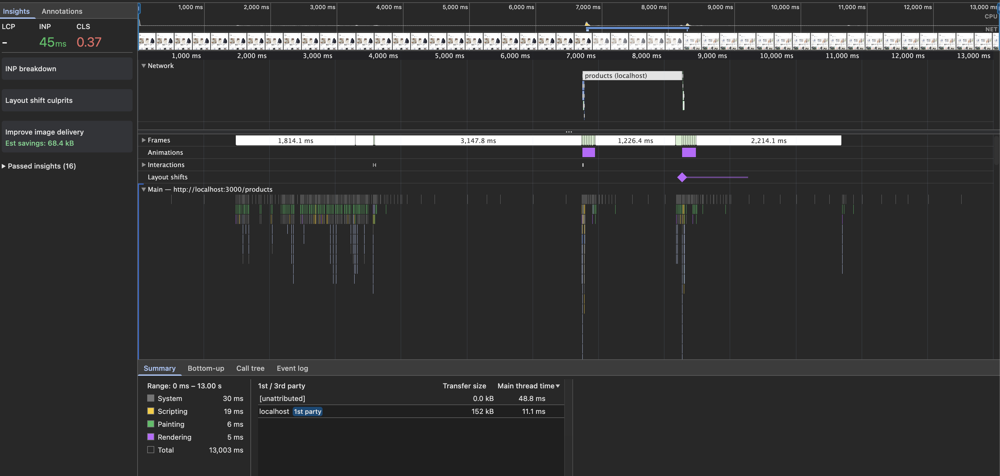

`Layout shift culprits`를 펼치면 두 가지가 더 보인다.

- **Layout shifts 다이아몬드가 Animations 트랙의 `opacity` 구간과 같은 지점(≈8,280ms, "Worst cluster: Layout shift cluster @ 8.28s")에서 겹친다.** 목록에 걸었던 `opacity 0.6 → 1` 전환이 끝나는 순간과 레이아웃 시프트가 동시에 일어난다 — 흐림을 걷어내며 새 데이터로 교체하는 시점에 카드 크기가 같이 바뀐다는 뜻이다.
- **DevTools 자체가 "Could not detect any layout shift culprits"라고 표시한다.** 자동 분석은 원인 노드를 짚지 못했고, `node_id 418`이 `old_rect` 높이 142px → `new_rect` 높이 453px로 튀었다는 근거는 화면이 아니라 트레이스 JSON(`LayoutShift` 이벤트의 `impacted_nodes`)을 직접 읽어서 나온 것이다.


**filmstrip은 t=0~200ms까지만 프레임이 있고 이후 t≈1,434ms까지 새 프레임이 없다.** 약 1.2초 동안 화면에 변화가 없었다는 뜻이라 "기존 목록이 남은 채 흐려지기만 한다"는 기대와는 일단 부합한다.

다만 1,434ms에 프레임이 재개되는 시점은 응답 완료(change 기준 1,519.8ms)보다 **약 85ms 이르다.** 이 85ms 동안 뭐가 다시 그려졌는지는 이 트레이스만으로 특정하지 못했다 — Layout shift는 여전히 응답 완료 이후(1,523.5ms)에 일어나므로 "응답 도착 직후 카드가 튄다"는 결론 자체는 유효하지만, 1,434ms의 프레임 재개 원인은 미확인으로 남겨둔다.

**LayoutShift 이벤트(`had_recent_input: false`, score 0.367)의 `impacted_nodes`를 보면 `ProductCard` 카드 하나(`node_id 418`)가 `old_rect [16, 787, 291, 142]` → `new_rect [16, 285, 291, 453]`로 이동한다.** 같은 노드가 높이 142px에서 453px(실제 카드 높이)로, y좌표도 787→285로 크게 움직였다. 나머지 impacted node(카드 하나, `actions`, `H2`)는 `old_rect [0,0,0,0]`으로 이전에 레이아웃에 없던 새 요소다.

- **6상태 표의 "이전 데이터가 있는 갱신"은 충족되지 않는다.** 명세가 기대하는 "기존 목록 유지 + `opacity 0.6` + `aria-busy`"는 화면이 멈춰 있는 구간(0~1,434ms)에서는 맞지만, 새 데이터가 그려지는 순간 카드 레이아웃이 튀며 CLS 0.37을 만든다. CLS 0이었던 최초 진입과 다른 결과다.
- **원인은 아직 가설 단계다.** `old_rect` 높이 142px는 정상 카드 높이(453px)와 다르다. 갱신 시작 시점에 그리드가 일시적으로 다른 형태(개수가 줄어든 상태의 재배치, 또는 opacity만 걸린 이전 카드가 다른 높이로 측정됨)였을 가능성이 있는데, 이 트레이스만으로는 어느 쪽인지 확정할 수 없다. `관찰 → 가설 → 반증` 표에서 다뤄야 한다. (5번 시나리오에서 정확히 같은 `score`로 재현된다 — 일회성 노이즈가 아니라 갱신마다 나는 구조적 문제로 보인다.)

### 3. 성공 + 0건 — 측정 결과

이 녹화는 직전 시나리오(카테고리=디지털)에 이어서 검색창에 `zzz` → `zzzz`를 입력한 상태다. `before-products-empty.json`의 첫 filmstrip 프레임(`ts=35915880583`)을 t=0 기준으로 잡았다.

| 항목         | 값                                                                                   |
| ------------ | ------------------------------------------------------------------------------------ |
| 입력         | 검색창에 `zzz` 입력 후 잠깐 멈춤 → `z` 한 글자 더 입력해 `zzzz`                      |
| API 요청 1   | `/api/products?q=zzz&category=digital&sort=latest&page=1&pageSize=12&scenario=slow`  |
| API 요청 2   | `/api/products?q=zzzz&category=digital&sort=latest&page=1&pageSize=12&scenario=slow` |
| 요청 시작    | 1번 t≈2,753ms, 2번 t≈3,238ms (간격 484ms)                                            |
| API Duration | 1번 1,509.4ms, 2번 1,509.2ms                                                         |
| 응답 완료    | 1번 t≈4,263ms, 2번 t≈4,747ms (2번이 나중에 시작해 나중에 끝남 — 순서 뒤집히지 않음)  |
| CLS          | **0.00**                                                                             |
| INP          | 43ms (Input delay 3ms + Processing 0ms + Presentation delay 40ms)                    |


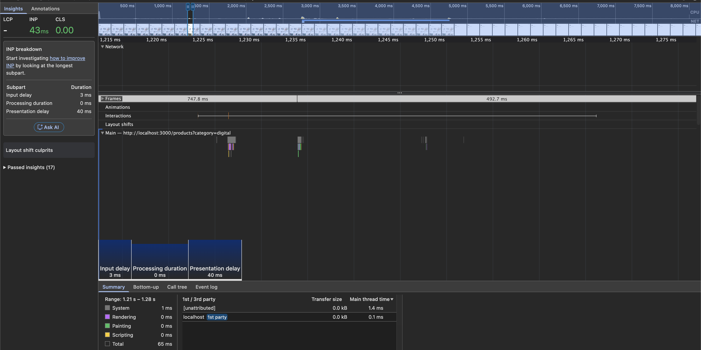

키 입력 이벤트를 debounce 타이밍과 맞춰보면 둘 다 정상 300ms debounce로 설명된다.

- `zzz`의 마지막 입력은 요청 1 시작 304ms 전이고, `zzzz`로 이어지는 4번째 입력은 요청 1이 이미 나간 뒤(181ms 뒤) 들어왔다. 그 입력으로부터 다시 304ms 뒤에 요청 2가 나갔다.
- **즉 이번 케이스는 debounce가 실패한 게 아니라, 사용자가 300ms보다 길게 끊어 쳐서 debounce 창이 두 번 만들어진 것이다.** 요청이 취소되지 않고 둘 다 200으로 끝났지만 순서가 뒤집히지 않아(1번이 먼저 끝나고 2번이 나중에 끝남) 화면에는 마지막 요청(`zzzz`) 결과만 남는다.
- 진짜 취소·경쟁 상태 검증은 5번(1.5초 안에 4회 연속 변경) 몫이다. 여기서는 debounce 자체가 스펙대로 동작하는지만 확인된다.
- CLS 0, "검색 결과가 없습니다."로 전환될 때도 레이아웃 시프트가 없다 — 2번 시나리오의 카드 크기 점프와 달리, 빈 상태 전환은 별도 개입 없이 통과한다.

### 4. 최초 실패 / 갱신 실패 — 측정 결과

`Network request blocking`(새 Chrome은 `Request conditions`) 패턴은 `*/api/products*`가 URLPattern 파싱에 실패해서 `http://localhost:3000/api/products*`로 바꿔 적용했다. 두 트레이스(`before-products-init-error.json`, `before-products-refetch-error.json`) 모두 `/api/products` 요청 자체가 `ResourceSendRequest` 이벤트로 남지 않는다 — DevTools가 CDP 레벨에서 요청을 만들기 전에 끊기 때문에 Network 패널에도, 트레이스에도 안 잡히고 `fetch()`만 reject된다.

| 항목                      | 최초 실패                                 | 갱신 실패                                          |
| ------------------------- | ----------------------------------------- | -------------------------------------------------- |
| 조작                      | 차단 켠 채 `/products` 최초 진입          | 목록 로드 후 차단 켬 → 카테고리 "전체"→"잡화" 변경 |
| URL                       | `localhost:3000/products`                 | `localhost:3000/products?category=goods`           |
| LCP                       | **0.10s** — `H1`(4,522 size, "상품 목록") | -                                                  |
| INP                       | -                                         | 30ms                                               |
| CLS                       | 0                                         | 0.00                                               |
| `/api/products` 요청 흔적 | 트레이스에 없음(차단)                     | 트레이스에 없음(차단)                              |

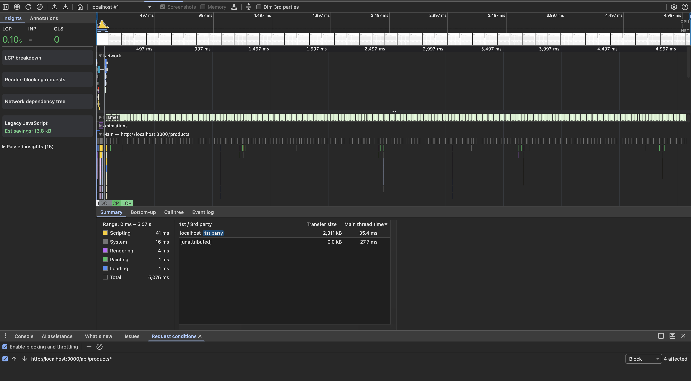
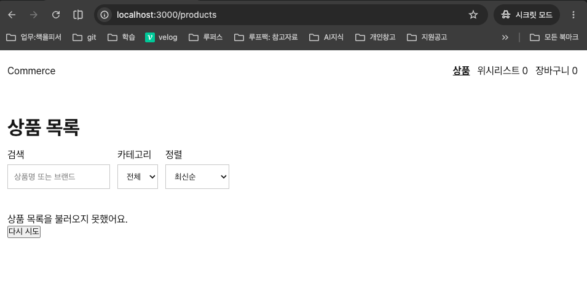

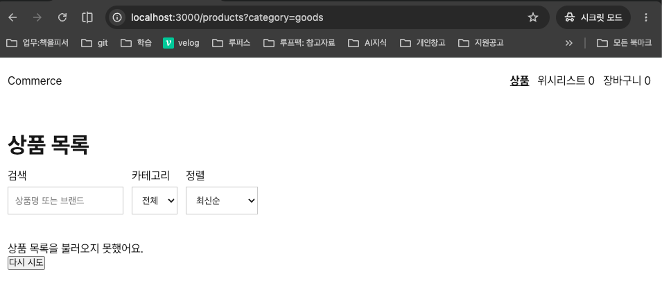

관찰 결과는 계획 문서의 기대와 다르다.

- **"두 화면이 달라야 한다"는 기대가 반증됐다.** 최초 실패 화면과 갱신 실패 화면이 **똑같다.** 둘 다 목록 자리에 "상품 목록을 불러오지 못했어요." + `다시 시도` 버튼만 있고, 갱신 실패 쪽에도 이전에 떠 있던 카드 12개가 하나도 안 남아 있다. 명세가 요구하는 "갱신 실패는 기존 목록이 남은 채 에러가 붙는다"를 **충족하지 못한다.**
- **부가로 발견한 것 — 카테고리 select가 URL과 어긋난다.** 갱신 실패 화면의 주소창은 `category=goods`인데 카테고리 `select`는 "전체"를 보여준다. 쿼리 실패 시 화면이 초기화되면서 선택값도 함께 날아간 것으로 보인다. 6상태 표와는 별개로 원인 후보에 추가해야 한다.
- LCP가 0.10s로 아주 빠른 건 개입 결과가 아니라 **네트워크 실패라 기다릴 대상 자체가 없었기 때문**이다(`H1` 텍스트가 유일한 LCP 후보). 이 값 자체를 성과로 읽으면 안 된다.

### 5. 빠른 연속 변경 — 측정 결과 (이번 측정의 핵심)

계획은 카테고리를 1.5초 안에 4번(캐주얼→패션→홈→디지털) 바꾸는 거였는데, 실제로는 드롭다운을 훑으며 **5번**(캐주얼→잡화→패션→홈→디지털) 바뀌었고 총 소요는 send 기준 처음~마지막이 **약 4.8초**로 1.5초보다 길다. 계획과 다르게 진행됐다는 걸 그대로 남긴다 — 그래도 "이전 요청이 끝나기 전에 다음 요청이 나간다"는 핵심 조건 자체는 5번 전환 모두에서 성립한다.

| 카테고리 | 요청 시작(t) | 응답 완료(t) | 다음 요청 시작과의 관계                      |
| -------- | ------------ | ------------ | -------------------------------------------- |
| casual   | 2,025.4ms    | 3,538.1ms    | goods가 casual 완료 **전**(2,993.7ms)에 시작 |
| goods    | 2,993.7ms    | 4,508.7ms    | fashion이 goods 완료 전(4,312.6ms)에 시작    |
| fashion  | 4,312.6ms    | 5,824.2ms    | home이 fashion 완료 전(5,754.9ms)에 시작     |
| home     | 5,754.9ms    | 7,265.2ms    | digital이 home 완료 전(6,848.1ms)에 시작     |
| digital  | 6,848.1ms    | 8,359.0ms    | 마지막 요청, URL과 최종 일치                 |

Network 패널(All 필터가 아니라 Fetch/XHR)에서 5건 전부 **Status 200, Time 1.51s대**로 확인된다. **`(canceled)`는 하나도 없다.**

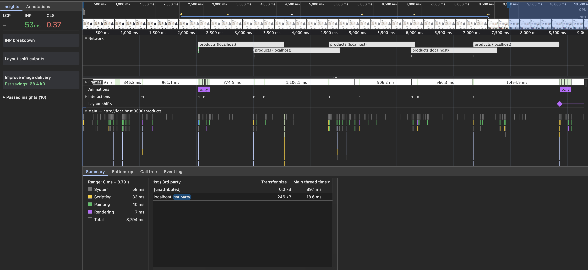


정지 후 화면은 주소창 `category=digital`, `select` "디지털", 디지털 카테고리 상품 6개로 **URL·select·목록이 셋 다 일치한다.** 이전 카테고리(캐주얼·잡화·패션·홈) 상품이 섞여 있거나 남아있는 흔적은 없다.

**Step 5 개입 근거로 예상했던 가설이 정확히 맞았다.** `AbortSignal`이 `fetch`에 안 넘어가 있어서 5건이 다 완료로 뜬다.

- **`src/entities/product/api/api.ts:14`의 `getProductList`는 `fetch`를 호출할 때 `AbortSignal`을 받지도, 넘기지도 않는다.** `queries.ts`의 `queryFn: () => getProductList(params)`도 TanStack Query가 `queryFn`에 넘겨주는 `{ signal }` 컨텍스트를 사용하지 않는다. 그래서 카테고리가 바뀌어도 이전 요청은 취소되지 않고 서버 응답(1.5초)까지 그대로 실행된다.
- **그런데도 화면은 `digital`로 정확히 끝난다 — CLS 0.37 외에는 화면이 늦게 도착한 응답에 덮이지 않는다.** 원인은 취소가 아니라 **query key 격리**다. `productQueryKeys.list(params)`(`src/entities/product/api/queries.ts:16`)가 `category`를 포함한 `params` 전체를 key로 쓰기 때문에, `casual`·`goods`·`fashion`·`home` 응답은 각자의 캐시 엔트리에만 반영되고 화면이 구독하는 건 현재 `category=digital` key뿐이다. 늦게 도착한 이전 카테고리 응답이 캐시는 채우지만 화면을 다시 그리게 만들지 않는다.
- **이번 녹화에서 화면이 안 덮인 건 우연이 아니라 필연이다.** 하지만 우연히 안전한 부분도 하나 있다 — 5건의 API Duration이 전부 1,505~1,515ms로 거의 동일해서 **송신 순서가 곧 응답 순서**였다. 만약 이 서버가 `scenario=slow`처럼 고정 지연이 아니라 요청마다 지연이 들쭉날쭉한 실제 네트워크였다면, 먼저 보낸 `casual` 응답이 나중에 보낸 `digital` 응답보다 늦게 도착하는 경우도 생길 수 있다. 그 경우에도 query key 격리 덕분에 화면이 덮이지는 않겠지만, 검증하려면 응답 지연을 요청마다 다르게 준 재현이 필요하다 — 이번 측정 범위 밖이다.
- **CLS 0.37은 2번 시나리오와 동일한 `LayoutShift` 이벤트(`score 0.3671410915759678`)다.** `digital` 응답 완료 4.3ms 뒤 발생한다. 우연의 일치가 아니라 2번에서 짚은 `ProductCard` 142px→453px 점프가 카테고리 전환마다 재현된다는 뜻이다. 6상태 표의 "취소" 행도 이 CLS 문제를 안고 있다.

## 목록 6상태 관찰

| 상태                    | 현재 화면                                                                  | 충족 여부                       | 개입 / 미개입 근거                                                                                                    |
| ----------------------- | -------------------------------------------------------------------------- | ------------------------------- | --------------------------------------------------------------------------------------------------------------------- |
| 데이터 없는 최초 진입   | skeleton 12개 → 1.5초 뒤 목록                                              | 충족                            | CLS 0, 카드 자리 유지. 무개입                                                                                         |
| 이전 데이터가 있는 갱신 | 1.2초는 기존 목록 유지, 응답 도착 시 카드 레이아웃 튐                      | **미충족**                      | CLS 0.37. `ProductCard` 높이가 142px→453px로 점프. 개입 필요, 원인은 가설 단계                                        |
| 성공 + 0건              | "검색 결과가 없습니다." 전환, 요청 2건(debounce 창 2개) 모두 순서대로 완료 | 충족                            | CLS 0. debounce는 스펙대로 동작. 무개입                                                                               |
| 최초 실패               | 목록 자리에 에러 + 다시 시도                                               | 충족                            | 에러 메시지·다시 시도 버튼 확인됨(스크린샷). LCP 0.10s는 대기 대상이 없어 빠른 것뿐이라 판정 근거로 쓰지 않음. 무개입 |
| 갱신 실패               | 목록이 사라지고 에러로 대체, 카테고리 select도 초기화                      | **미충족**                      | 명세는 "기존 목록 유지"를 요구하나 실제로는 전부 사라짐. 개입 필요                                                    |
| 취소                    | 요청 5건 전부 완료(취소 없음), 화면은 마지막 카테고리로 정확히 귀결        | 충족(레이스는), **미충족(CLS)** | query key 격리로 화면 안 덮임(무개입). 단 착지 시 CLS 0.37 재현 — 2번과 같은 원인, 개입 필요                          |

## 관찰 → 가설 → 반증 → 최소 변경

각 항목을 한 문장으로 적는다. 홈 Hero LCP는 이미 "[Step 4 개입 후보](#step-4-개입-후보)"에 후보 1~3으로 정리돼 있어 아래 표에서는 제목만 참조하고, 상품 목록에서 새로 나온 항목만 채운다.

| 관찰한 사실                                                                         | 원인 가설                                                                                        | 반증 방법                                                                             | 먼저 시도할 가장 작은 변경                                                          |
| ----------------------------------------------------------------------------------- | ------------------------------------------------------------------------------------------------ | ------------------------------------------------------------------------------------- | ----------------------------------------------------------------------------------- |
| 홈 Hero LCP 662.1ms의 78%가 Resource load delay                                     | [Step 4 개입 후보](#step-4-개입-후보) 참고(후보 1~3)                                             | 각 후보 문단의 반증 방법 참고                                                         | 후보 2(preload+fetchpriority)부터, 근거는 해당 문단                                 |
| 카테고리 갱신·레이스 응답 완료 직후 `ProductCard`가 142px→453px로 점프하며 CLS 0.37 | 갱신 시작 시점에 그리드가 카드 개수·높이가 다른 중간 상태를 거쳤다가 실제 카드 높이로 재배치된다 | 갱신 중 DOM을 스냅샷해 중간 상태의 카드 높이를 직접 확인                              | 갱신 중에도 이전 목록을 DOM에서 안 지우고 `opacity`만 바꾸도록 렌더 경로 통일       |
| 갱신 실패 시 기존 목록 12개가 전부 사라지고 최초 실패와 같은 화면으로 대체됨        | 쿼리 실패 시 컴포넌트가 `data`를 유지하지 않고 에러 전용 분기로 완전히 스위칭한다                | 실패 시 `isError`와 `data` 유무를 함께 확인해 이전 `data`가 실제로 비는지 로그로 검증 | 에러 시에도 `placeholderData`/이전 `data`를 유지하고 에러는 목록 위에 배너로만 표시 |
| 갱신 실패 화면에서 카테고리 `select`가 "전체"로 보이는데 URL은 `category=goods`     | select 값이 URL이 아니라 쿼리 결과(또는 실패로 리셋된 로컬 상태)에서 파생된다                    | select의 `value` prop이 실제로 어디서 오는지 소스에서 확인                            | select value를 URL 상태(`useQueryStates`)에서만 파생하도록 단일화                   |

## metadata 증거

| 상황                           | 증거                                        | 기록 |
| ------------------------------ | ------------------------------------------- | ---- |
| normal                         | document 응답 / 초기 HTML                   |      |
| 정상 empty                     | URL 조건 / 0건 metadata / OG fallback image |      |
| metadata query failure         | root 공통 metadata 상속 여부                |      |
| 서버 호출 계수                 | 임시 로그 계수 / 제거 여부                  |      |
| 일반 UA vs facebookexternalhit | `time_starttransfer`, `time_total`          |      |

---

이 문서는 [plan.md](plan.md)에서 분리했다. 측정값은 작성자가 직접 수집했고, `before-home-record.json` 트레이스에서 filmstrip 표시 순서와 paint 마커를 추출해 표로 정리한 것은 Claude(AI)다. 빈 표는 틀만 만들어 두었고 작성자가 채운다.
